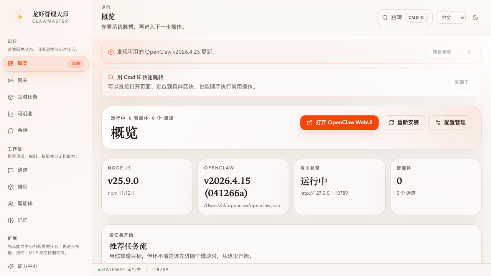
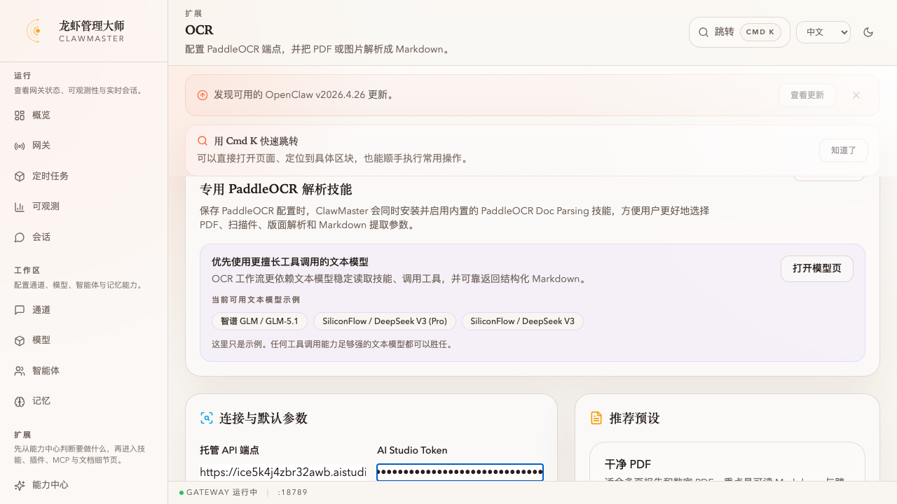
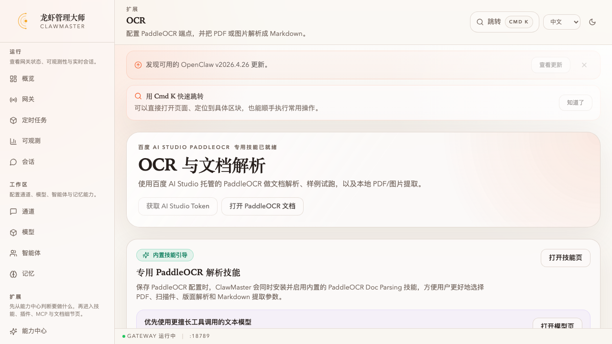
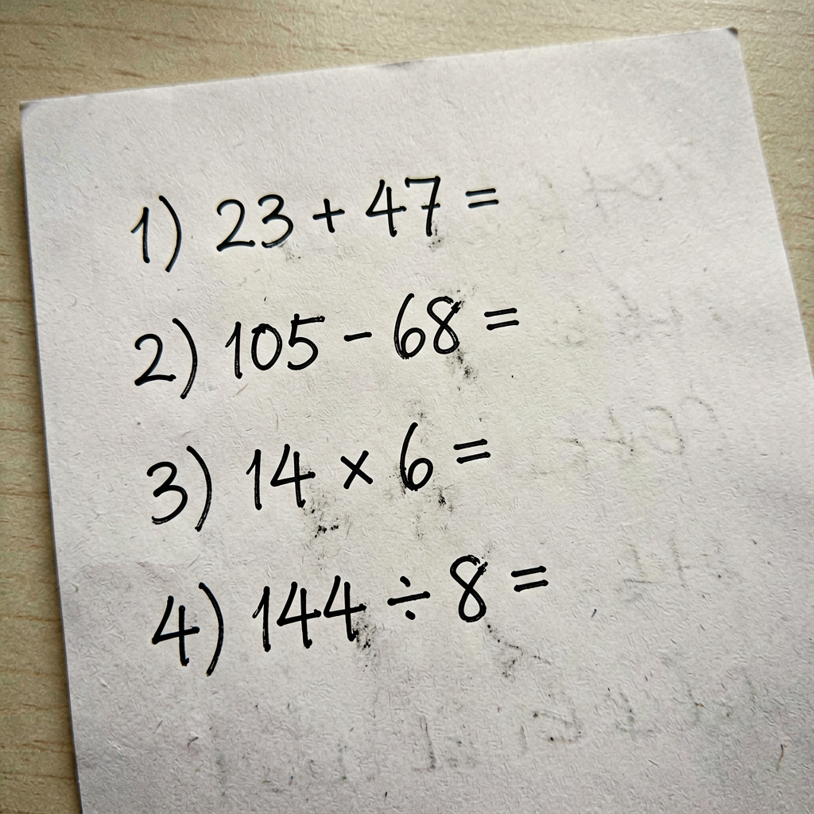
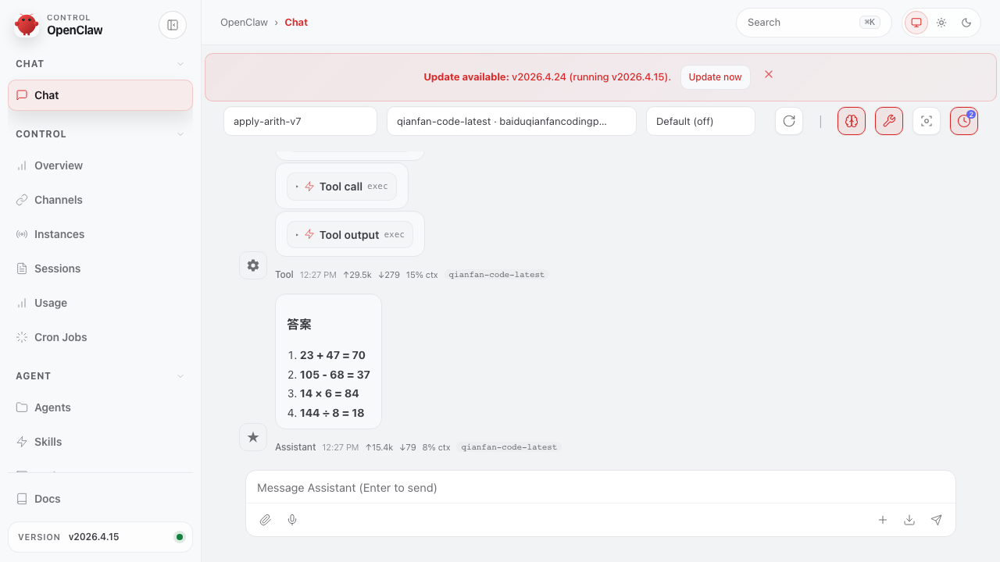
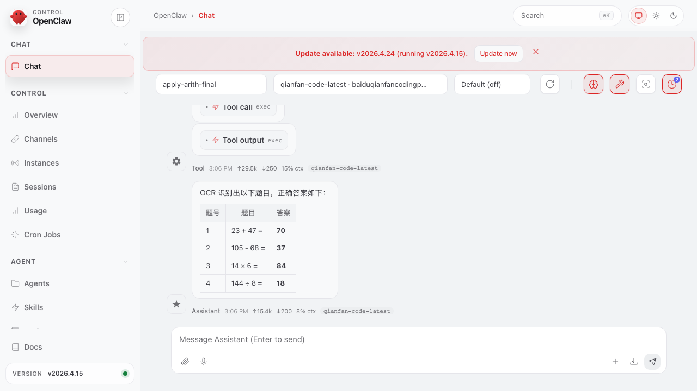
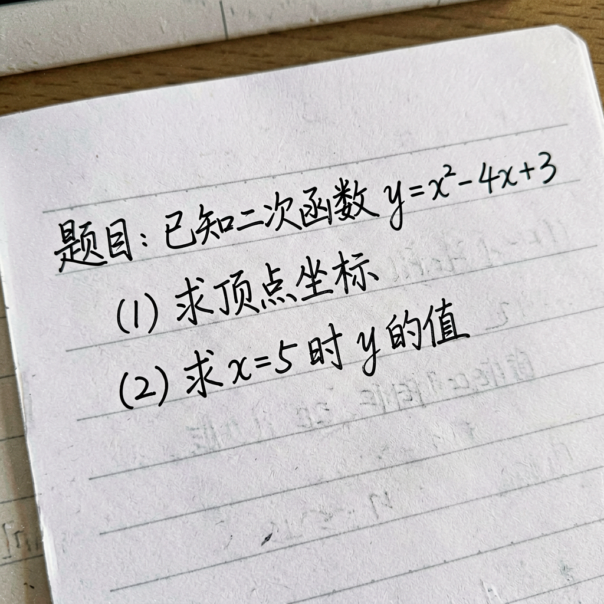
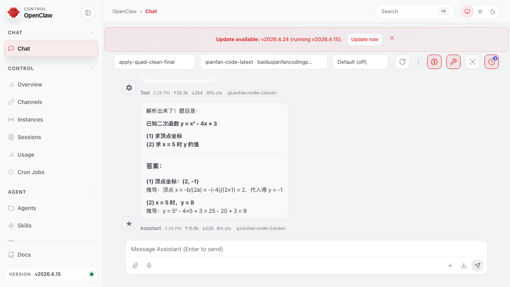

# 任务：在 OpenClaw WebUI 里用 PaddleOCR 识别手写数学题再让 agent 解答

**能力域**：Apply · **用时**：~12 min · **难度**：入门+（需先做 [wizard-ernie-glm](../../setup/wizard-ernie-glm/README_CN.md)）

> 在 ClawMaster **可观测 · 概览** 页点右上角 **打开 OpenClaw WebUI**。配好 **PaddleOCR 文档解析** 之后，把一张手写数学题的照片（先拿 `ernie-image` 技能生成）扔进工作区，然后像日常问人一样问一句「OCR 一下 workspace/images 里的数学题并给出答案」——agent 会自己从技能目录里找到 `paddleocr-doc-parsing`，调脚本、拿 markdown、给答案。这一环验证「skill 在 agent 提示词里被看到 → 被正确选用」的链路。

> 🌐 English：[README.md](./README.md) · 日本語：[README_JP.md](./README_JP.md)

## 前置条件

1. 已完成 [wizard-ernie-glm](../../setup/wizard-ernie-glm/README_CN.md)：ClawMaster 跑在 <http://localhost:16223>，网关在跑，至少 1 个文本模型可用
2. **Baidu AI Studio 账号 + 已部署的 PaddleOCR 在线服务**。进入 <https://aistudio.baidu.com/paddleocr/task>，新建任务 → 选 layout-parsing → 部署。拿两样东西：
   - **Endpoint**：形如 `https://ice5k4j4zbr32awb.aistudio-app.com/layout-parsing`
   - **Token**：AI Studio 个人中心的访问令牌
3. 能正常跑 `ernie-image` 技能（前一步的 wizard 会把百度 AI Studio 接进来）

---

## 第 1 步：从 ClawMaster 跳进 OpenClaw WebUI

ClawMaster 左侧导航 → **概览**。右上角就是 **打开 OpenClaw WebUI** 按钮：



点一下新标签页打开 `http://127.0.0.1:18789/?token=...`，就是 OpenClaw 自带的聊天 UI（跟 ClawMaster 是两个前端，共用一个网关）。

> 💡 也可以走 cron 卡片、可观测页或设置页里各种「在 WebUI 中打开」按钮，它们都指向同一个 WebUI，只是带了不同的 `session` 参数。

---

## 第 2 步：配置 OCR 能力

切回 ClawMaster，左侧 **OCR** 页。这页**只支持百度 PaddleOCR**——`paddleocr-doc-parsing` 是 ClawMaster 发货时随包的内置技能。



填两个字段：

- **托管 API 端点**：贴 AI Studio 给你的 URL（layout-parsing 路径）
- **AI Studio Token**：访问令牌

下面的 9 个开关基本保持默认即可（自动方向校正、版面分析、合并跨页表格都是打开的，适合手机拍摄的手写稿）。

点 **保存并启用 OCR**：



背后发生了三件事：

1. `ocr.providers.paddleocr.{endpoint, accessToken, ...}` 写进 `~/.openclaw/openclaw.json`
2. 随包的 `paddleocr-doc-parsing` 技能目录被 link 到 `~/.openclaw/workspace/skills/paddleocr-doc-parsing/`
3. `skills.entries.paddleocr-doc-parsing.enabled = true`——这个技能现在会进入 agent 的提示词范围

> ⚠️ 如果你本地 `openclaw` CLI 还是 ≤ 2026.4.15 的旧版，`openclaw doctor --fix` 会误把 `ocr` key 删掉（schema 里不认识）。两条对策：① 升级 `npm i -g openclaw@latest`；② 暂时用环境变量给网关：`PADDLEOCR_ENDPOINT=... PADDLEOCR_TOKEN=... openclaw gateway run`，技能脚本同样会读取。

---

## 第 3 步：拿 `ernie-image` 生成一张手写数学题

不想去拍真纸也行——ClawMaster 附带的 `ernie-image` 技能就能生成。最直接的 API 调用（workshop 时在 Claude Code 里让 `ernie-image` 技能自动处理）：

```bash
curl -sS -X POST https://aistudio.baidu.com/llm/lmapi/v3/images/generations \
  -H "Authorization: Bearer $AISTUDIO_TOKEN" \
  -H "Content-Type: application/json" \
  -d '{
    "model": "ernie-image-turbo",
    "prompt": "真实照片，白色作业本纸用黑色签字笔手写小学三年级数学四则运算题目，4 道，题号 1-4 逐行书写：1) 23 + 47 =  2) 105 - 68 =  3) 14 × 6 =  4) 144 ÷ 8 =。题目右侧留空格让学生填答案。照片光线自然。",
    "n": 1, "response_format": "b64_json", "size": "1024x1024"
  }' | jq -r '.data[0].b64_json' | base64 -d \
  > ~/.openclaw/workspace/images/math-quiz-1.png
```

得到一张像真拍的手写题：



放进 `~/.openclaw/workspace/images/` 目录——这是 OpenClaw agent 默认 `cwd` 下的工作区路径，之后说「workspace/images 里的图」就找得到。

---

## 第 4 步：回 WebUI，像问人一样问

回到前面打开的 OpenClaw WebUI 标签页。URL 里把 `session` 改成 `agent:main:apply-arith`（或任意唯一 key）开一条新会话。模型保持 **Default**（DeepSeek-V3 / qianfan-code-latest 这类纯文本模型都行——OCR 和解算术都不需要 VL 模型）。

底部输入框敲一句自然的话：



```
OCR 一下 workspace/images 里的数学题并给出正确答案。
```

**关键点**：这里不告诉 agent 用哪个技能、哪条命令、哪个路径。只要 `paddleocr-doc-parsing` 在技能列表里可见（第 2 步的 `skills.entries.<skill>.enabled = true`），agent 会自己从技能 `description` 字段里匹配到「OCR this image」「parse this scan into markdown」，然后按 SKILL.md 的 workflow 执行。

**回车。** 约 60~90 秒，agent 在 WebUI 里可见地走完 tool call 流水并给出答案（一张图里看完 `exec` 气泡 + 最终答案表）：



agent 顺序做了这些事：

1. **Tool call: exec** — `ls -la workspace/images` 找到 `math-quiz-1.png`
2. **Tool call: exec** — 直接跑 `node ~/.openclaw/workspace/skills/paddleocr-doc-parsing/scripts/parse-document.mjs ~/.openclaw/workspace/images/math-quiz-1.png`（skill 已经被 agent 认出来，省了单独 read SKILL.md 这一步）
3. **Tool output** — PaddleOCR 返回 markdown，4 道题整整齐齐识别成 `1) $ 23 + 47 = $ / 2) $ 105 - 68 = $ / 3) $ 14 × 6 = $ / 4) $ 144 ÷ 8 = $`
4. **Assistant** — 输出答案表

`Tool ↑29.5k / ↓250` 是 tool 轮次的 token（大头来自 PaddleOCR markdown 回传），`Assistant ↑15.4k / ↓200` 是最终合成答案。**没有一行提示词涉及 OCR 脚本、skill 路径、OCR 参数——但 agent 把这些细节全打理了**。这就是「skill 被正确安装并在 prompt 里可见」的验证：让 agent 自己找到、自己调、自己解释。

---

## 第 5 步：换一题——初中二次函数

同一条链路，换个更复杂的样本：初中应用题。再用 `ernie-image` 生成一张（prompt 里换成「已知二次函数 y = x² - 4x + 3, (1) 求顶点坐标 (2) 求 x=5 时 y 的值」），存到 `~/.openclaw/workspace/images/math-quiz-2.png`：



WebUI 里再开一条 session（`agent:main:apply-quad`），发一句同样简短的话：

```
看一眼 workspace/images 里的数学题图片，告诉我答案。
```

agent 一样先 `exec ls` → `exec parse-document.mjs` → 把 markdown 翻译成数学步骤：



```
(1) 顶点坐标
  a = 1, b = -4, c = 3
  x = -b / (2a) = 2
  y = 2² - 4·2 + 3 = -1
  顶点：(2, -1)

(2) x = 5 时 y
  y = 5² - 4·5 + 3 = 8
  答案：y = 8
```

对比两题：

| 维度 | 算术题 | 二次函数 |
|---|---|---|
| OCR 难度 | 四则运算，`×`/`÷` 符号 | `x²` 指数 + `(2, -1)` 坐标 + `y=5` 函数值 |
| OCR 输出 | `1) $ 23 + 47 = $ ...` | `y = x^{2} - 4x + 3`（标准 LaTeX）|
| 解答侧 | 4 次四则运算 | 顶点公式 + 代入 + 两小问分步 |
| 所需模型 | 纯文本模型 | 纯文本模型（OCR 已经把 `x²` 结构化）|

OCR 把「图」转成「结构化 LaTeX 文本」，文本模型就能干自己擅长的事——**这条链路的价值在于把 vision 的不稳定性挡在 OCR 这一环，而不是交给最后解题的 LLM**。

---

## 第 6 步：回看这次跑用了什么 token

装了 ClawProbe（参考 [cron-cost-digest](../../observe/cron-cost-digest/README_CN.md)）的话，回可观测页看 **最新会话** 卡：`agent:main:apply-quad` 这条会排在最上面，看得到 ↑ 输入 token、↓ 输出 token、模型名、USD 估值。

如果 OCR 这条链路接进定时成本摘要，就能知道「生成图像 + OCR + 解题」一个月花多少——后面接 Feishu/iMessage 渠道做「拍张题照片、bot 给答案」时，成本是可量化的。

---

## 交叉验证

```bash
# 1) 技能已安装 + 启用
ls ~/.openclaw/workspace/skills/paddleocr-doc-parsing/
jq '.skills.entries["paddleocr-doc-parsing"]' ~/.openclaw/openclaw.json

# 2) OCR 配置写对（新版 ClawMaster ≥ 2026.4.24 才写 `ocr` key；旧版 CLI 会报 Unrecognized key）
jq '.ocr.providers.paddleocr | {endpoint, hasToken: (.accessToken | length > 0)}' ~/.openclaw/openclaw.json

# 3) 不用 agent，直接跑技能脚本对一下结果
SKILL_DIR=~/.openclaw/workspace/skills/paddleocr-doc-parsing
node $SKILL_DIR/scripts/parse-document.mjs \
  ~/.openclaw/workspace/images/math-quiz-1.png \
  --preset mobile-scan --markdown-out /tmp/math-quiz.md
cat /tmp/math-quiz.md

# 4) 仅测试 endpoint / token 是否通
node $SKILL_DIR/scripts/test-connection.mjs

# 5) 确认网关在跑 + 已配对
curl -sS --noproxy '*' http://localhost:18789/health  # {"ok":true,"status":"live"}
openclaw cron list 2>&1 | head -2                     # 不该报 pairing required
```

---

## 常见问题

**Q：agent 没调 OCR 技能，直接看图给了个错答案** → 两种可能：
1. **记忆污染**：如果上下文里带了老的会话记忆（比如之前试错过「PaddleOCR 未配置」），agent 会跳过 OCR 去瞎猜。用一个全新的 session key，或者先清一下 `powermem` 里相关的干扰记忆。
2. **技能没被识别**：`paddleocr-doc-parsing` 可能没 enable。去 ClawMaster **技能** 页手动启用，或 `openclaw config set skills.entries.paddleocr-doc-parsing.enabled true`。

如果上面都排除了还不调用，把提示词改得更明示：`使用 paddleocr-doc-parsing 技能识别 workspace/images 里的图片并给出答案`——直接点名 skill。

**Q：`openclaw cron list` 报 `Unrecognized key: "ocr"`** → 旧版 CLI 不认识 ClawMaster 写的 `ocr` key。升级：`npm i -g openclaw@latest`。暂不升级的话，用环境变量跑网关：`PADDLEOCR_ENDPOINT=<url> PADDLEOCR_TOKEN=<token> openclaw gateway run --bind loopback`，技能脚本会从 `process.env` 读。

**Q：PaddleOCR 脚本报 `Missing PaddleOCR endpoint`** → 检查 `~/.openclaw/openclaw.json` 里 `ocr.providers.paddleocr.endpoint` 是否有值；或者 `echo $PADDLEOCR_ENDPOINT`。SKILL.md 里有 4 层回退：CLI flags → env vars → `ocr.providers.paddleocr` → `models.providers.baidu-aistudio.apiKey`（仅 token）。

**Q：AI Studio 部署的 PaddleOCR 要钱吗** → AI Studio 账号注册送一份免费额度，`layout-parsing` 是按请求次数计费（~0.01 CNY/次，手写 A4 稿一页一次就够）。workshop 规模（20 人 × 3 题）基本在免费额度内。

**Q：为什么不直接在 WebUI 上传图片让 VL 模型看图** → 能，但不稳：
- OpenClaw WebUI 的图片附件目前走 agent 的 `read` 工具传回 multimodal content，VL 模型拿到的图像在我们的测试里 **经常性地幻觉**（能看见图，但答案无中生有）
- 走 OCR 链路反而更稳、更便宜——OCR 先把图转成 LaTeX 文本，文本模型再推理，幻觉空间小很多

这也是为什么 Apply 章节把 OCR 作为主线：它是「把不可靠的视觉输入挡住的那层」。

**Q：agent 跑到第 3 遍了还在读 SKILL.md** → 上下文里有旧消息把它绕进去了。新建 session（URL `&session=agent:main:<fresh-key>`），或者提示词里加一句「你已经知道 paddleocr-doc-parsing 怎么用，直接 exec 脚本就行」。
