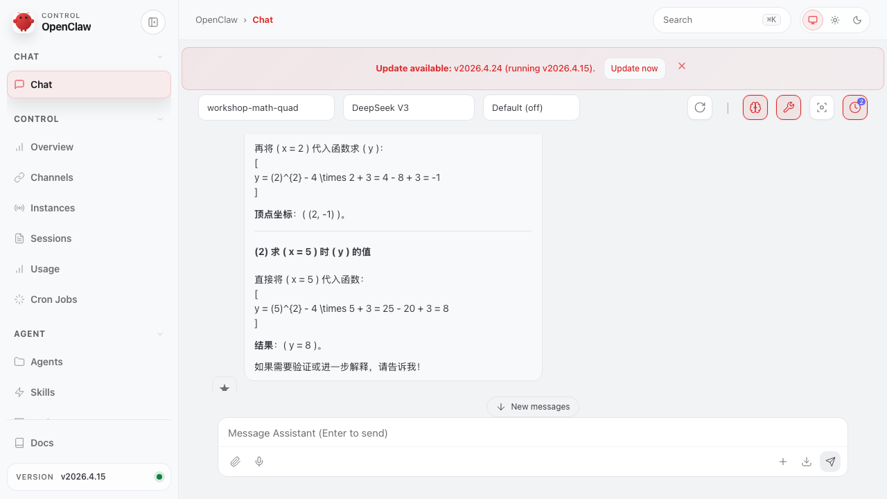

# 任务：在 OpenClaw WebUI 里用 PaddleOCR 识别手写数学题再让 agent 解答

**能力域**：Apply · **用时**：~12 min · **难度**：入门+（需先做 [wizard-ernie-glm](../../setup/wizard-ernie-glm/README_CN.md)）

> 在 ClawMaster **可观测 · 概览** 页点右上角 **打开 OpenClaw WebUI** 跳到 OpenClaw 自带的聊天 UI。配好 **PaddleOCR 文档解析** 能力后，把一张手写数学题的照片（先拿 `ernie-image` 技能生成一张）放到工作区，agent 会自己 read 技能说明、exec 跑 PaddleOCR 脚本、拿到 markdown 后再把每题的正确答案返回。整个流程在 WebUI 里一气呵成。

> 🌐 English：[README.md](./README.md) · 日本語：[README_JP.md](./README_JP.md)

## 前置条件

1. 已完成 [wizard-ernie-glm](../../setup/wizard-ernie-glm/README_CN.md)：ClawMaster 跑在 <http://localhost:16223>，网关在跑，至少 1 个文本模型可用
2. **Baidu AI Studio 账号 + 已部署的 PaddleOCR 在线服务**。进入 <https://aistudio.baidu.com/paddleocr/task>，新建任务 → 选 PaddleOCR-VL 或 layout-parsing → 部署。拿两样东西：
   - **Endpoint**：形如 `https://ice5k4j4zbr32awb.aistudio-app.com/layout-parsing`
   - **Token**：AI Studio 个人中心的访问令牌
3. 能正常跑 `ernie-image` 技能（前一步的 wizard 会把百度 AI Studio 接进来）

---

## 第 1 步：从 ClawMaster 跳进 OpenClaw WebUI

ClawMaster 左侧导航 → **概览**。右上角就是 **打开 OpenClaw WebUI** 按钮：


点一下新标签页打开 `http://127.0.0.1:18789/?token=...`，就是 OpenClaw 自带的聊天 UI（跟 ClawMaster 是两个前端，共用一个网关）。

> 💡 也可以走 cron 卡片、可观测页或设置页里各种「在 WebUI 中打开」按钮，它们都指向同一个 WebUI，只是带了不同的 `session` 参数。

---

## 第 2 步：配置 OCR 能力

切回 ClawMaster，左侧 **OCR** 页。这页**只支持百度 PaddleOCR**——`paddleocr-doc-parsing` 是 ClawMaster 发货时随包的内置技能。


填两个字段：

- **托管 API 端点**：贴 AI Studio 给你的 URL（layout-parsing 路径）
- **AI Studio Token**：访问令牌

下面的 9 个开关基本保持默认即可（自动方向校正、版面分析、合并跨页表格都是打开的，适合手机拍摄的手写稿）。

点 **保存并启用 OCR**：


背后发生了三件事：

1. `ocr.providers.paddleocr.{endpoint, accessToken, ...}` 写进 `~/.openclaw/openclaw.json`
2. 随包的 `paddleocr-doc-parsing` 技能目录被 link 到 `~/.openclaw/workspace/skills/paddleocr-doc-parsing/`
3. `skills.entries.paddleocr-doc-parsing.enabled = true`——这个技能现在会进入 agent 的提示词范围

> ⚠️ 如果你本地 `openclaw` CLI 还是 ≤ 2026.4.15 的旧版，`openclaw doctor --fix` 会误把 `ocr` key 删掉（schema 里不认识）。两条对策：① 升级 `npm i -g openclaw@latest`；② 暂时用环境变量给网关：`PADDLEOCR_ENDPOINT=... PADDLEOCR_TOKEN=... openclaw gateway run`，技能脚本同样会读取。

---

## 第 3 步：拿 `ernie-image` 生成一张手写数学题

不想去拍真纸也行——ClawMaster 附带的 `ernie-image` 技能就能生成。最直接：跑个 API 调用（workshop 时在 Claude Code 里 `ernie-image` 技能会自动帮你选参数和调用）：

```bash
curl -sS -X POST https://aistudio.baidu.com/llm/lmapi/v3/images/generations \
  -H "Authorization: Bearer $AISTUDIO_TOKEN" \
  -H "Content-Type: application/json" \
  -d '{
    "model": "ernie-image-turbo",
    "prompt": "真实照片，白色作业本纸用黑色签字笔手写小学三年级数学四则运算题目，4 道，题号 1-4 逐行书写：1) 23 + 47 =  2) 105 - 68 =  3) 14 × 6 =  4) 144 ÷ 8 =。题目右侧留空格让学生填答案。照片光线自然。",
    "n": 1, "response_format": "b64_json", "size": "1024x1024"
  }' | jq -r '.data[0].b64_json' | base64 -d \
  > ~/.openclaw/workspace/images/math-quiz.png
```

得到一张像真拍的手写题：


放进 `~/.openclaw/workspace/images/` 目录——这是 OpenClaw agent 默认 `cwd` 下的工作区路径，后面 agent 直接引用绝对路径就行。

---

## 第 4 步：回 WebUI，让 agent 跑完整流程

回到前面打开的 OpenClaw WebUI 标签页。左上角新建一个 session（URL 里改 `&session=agent:main:workshop-math`，或者直接点 **+** 按钮），模型保持 **Default (DeepSeek V3)**——OCR 和算术都不需要 VL 模型，文本模型足够。

在底部输入框敲：


```
我放了一张小学数学作业照片在 /Users/zhl/.openclaw/workspace/images/math-quiz.png。
请先 read ~/.openclaw/workspace/skills/paddleocr-doc-parsing/SKILL.md 了解用法，
再用 exec 运行 parse-document.mjs 把图片转成 markdown，最后给出每道题的正确答案。
```

> ⚠️ 提示词里写得越显式越好。如果只说「解一下这张图」，agent 会因为 `read` 工具不会做 vision 而卡住。把 read SKILL + exec 脚本这两步点破，agent 就会按 skill 文档的 workflow 往下走。

**回车。** 前后大约 60~90 秒，agent 会依次产出：


1. **Tool call: read** — 读 `paddleocr-doc-parsing/SKILL.md` 里的 workflow
2. **Tool output: read** — SKILL.md 全文（含脚本路径 + 预设说明）
3. **Tool call: exec** — 跑 `node .../parse-document.mjs /Users/zhl/.openclaw/workspace/images/math-quiz.png --preset mobile-scan`
4. **Tool output: exec** — PaddleOCR 返回的 markdown，里面已经把 4 道题识别成 `1) $23 + 47 =$ / 2) $105 - 68 =$ / 3) $14 \times 6 =$ / 4) $144 \div 8 =$`

最后一条 Assistant 消息就是给家长/学生的答案：


```
题目：
1. 23 + 47 =      2. 105 - 68 =      3. 14 × 6 =      4. 144 ÷ 8 =
正确答案：
1. 70             2. 37              3. 84            4. 18
```

`↑32.2k / ↓122` 说明这次 agent 对话消耗了 32.2k input token（其中大头是 PaddleOCR 返回的 markdown 喂回模型），生成 122 output token。

---

## 第 5 步：换一题——初中二次函数

PaddleOCR 跟 OCR 里的 `$$` 标记是能识别数学符号的，但算不等于解题。agent 负责把「识别出来的题目」代入标准解法。来一道更复杂的：

再用 `ernie-image` 生成一张（prompt 换成「初中二次函数 y = x² - 4x + 3，(1) 求顶点坐标 (2) 求 x=5 时 y 的值」），存到 `~/.openclaw/workspace/images/math-quiz-2.png`：


WebUI 里再开一条 session（`&session=agent:main:workshop-math-quad`），发：

```
我把一张初中数学应用题照片放在 /Users/zhl/.openclaw/workspace/images/math-quiz-2.png。
请使用 paddleocr-doc-parsing 技能识别图片里的题目（先 read 技能说明，
再用 exec 跑 parse-document.mjs，--preset mobile-scan 适合手写稿），
然后分步骤解答每一小问。
```

agent 这次会多走一步 `read` 预设指引，exec 调 OCR，拿到 markdown，然后分步骤解答两小问：



```
(1) 求顶点坐标
  a=1, b=-4, c=3
  x = -b/(2a) = 2
  y = 2² - 4·2 + 3 = -1
  顶点坐标：(2, -1)

(2) 求 x = 5 时 y 的值
  y = 5² - 4·5 + 3 = 25 - 20 + 3 = 8
  结果：y = 8
```

对比第一题主要变化：

- PaddleOCR 的 markdown 里会把 `y = x² - 4x + 3` 识别成 `y = x^{2} - 4x + 3`（标准 LaTeX）
- agent 用的是 DeepSeek-V3 的推理能力，不需要 vision 模型
- 输出长度 `↓334` 明显比算术题长，因为要铺开步骤

这就是这条 Apply 链路的真正价值：**OCR 把「图」转成「结构化文本」，文本模型才能干自己擅长的事**。

---

## 第 6 步：回看这次跑用了什么 token

如果装了 ClawProbe（参考 [cron-cost-digest](../../observe/cron-cost-digest/README_CN.md)），直接去可观测页看 **最新会话** 卡：刚才 `agent:main:workshop-math-quad` 这条应该排在最上面，看得到本次 session 的 ↑ 输入 token、↓ 输出 token、模型名、USD 估值。

当 OCR 这条链路接进定时成本摘要（每天 08:00 那条 cron），就能知道「生成图像 + OCR + 解题」一个月会花多少——工作坊之后接 Feishu/iMessage 渠道做「拍张题照片、bot 给答案」时，成本是可量化的。

---

## 交叉验证

```bash
# 1) 技能已安装 + 启用
ls ~/.openclaw/workspace/skills/paddleocr-doc-parsing/
jq '.skills.entries["paddleocr-doc-parsing"]' ~/.openclaw/openclaw.json

# 2) OCR 配置写对（新版 ClawMaster ≥ 2026.4.24 才写 `ocr` key；旧版 CLI 会报 Unrecognized key）
jq '.ocr.providers.paddleocr | {endpoint, hasToken: (.accessToken | length > 0)}' ~/.openclaw/openclaw.json

# 3) 不用 agent，直接跑技能脚本对一下结果
SKILL_DIR=~/.openclaw/workspace/skills/paddleocr-doc-parsing
node $SKILL_DIR/scripts/parse-document.mjs \
  ~/.openclaw/workspace/images/math-quiz.png \
  --preset mobile-scan --markdown-out /tmp/math-quiz.md
cat /tmp/math-quiz.md

# 4) 仅测试 endpoint / token 是否通
node $SKILL_DIR/scripts/test-connection.mjs

# 5) 确认网关在跑 + 已配对
curl -sS --noproxy '*' http://localhost:18789/health  # {"ok":true,"status":"live"}
openclaw cron list 2>&1 | head -2                     # 不该报 pairing required
```

---

## 常见问题

**Q：agent 回「图片无法直接查看或解析」就停下了** → 提示词没让它显式走 skill。OpenClaw 的 `read` 工具不做 vision；把「先 read SKILL.md，再 exec parse-document.mjs」写进提示词，或者在 `~/.openclaw/openclaw.json` 的 `agents.defaults.systemPrompt` 里默认挂上 PaddleOCR 使用规约。

**Q：`openclaw cron list` 报 `Unrecognized key: "ocr"`** → 旧版 CLI 不认识 ClawMaster 写的 `ocr` key。升级：`npm i -g openclaw@latest`。暂不升级的话，用环境变量跑网关：`PADDLEOCR_ENDPOINT=<url> PADDLEOCR_TOKEN=<token> openclaw gateway run --bind loopback`，技能脚本会从 `process.env` 读。

**Q：PaddleOCR 脚本报 `Missing PaddleOCR endpoint`** → 检查 `~/.openclaw/openclaw.json` 里 `ocr.providers.paddleocr.endpoint` 是否有值；或者 `echo $PADDLEOCR_ENDPOINT`。SKILL.md 里有 4 层回退：CLI flags → env vars → `ocr.providers.paddleocr` → `models.providers.baidu-aistudio.apiKey`（仅 token）。

**Q：AI Studio 部署的 PaddleOCR 要钱吗** → AI Studio 账号注册送一份免费额度，`layout-parsing` 是按请求次数计费（~0.01 CNY/次，手写 A4 稿一页一次就够）。workshop 规模（20 人 × 3 题）基本在免费额度内。

**Q：能不能跳过 PaddleOCR，直接让 VL 模型（Qwen3-VL / GLM-4V）看图** → 能，也是一条可行路线。但目前 OpenClaw WebUI 的 **图片上传** 框会把图片写到 `~/.openclaw/workspace/images/` 然后通过 agent 的 `read` 工具引用，而 `read` 只读文本，VL 模型拿不到图像二进制——所以 WebUI 的原生图片附件目前不等于多模态输入。走 OCR 链路反而更稳、更便宜。

**Q：agent 跑到第 3 遍了还在读 SKILL.md** → 上下文里带的旧消息把 agent 绕进去了。新建 session（URL `&session=agent:main:<fresh-key>`），或者把提示词里的「先 read、再 exec」改成「你已经读过 SKILL.md，直接 exec `parse-document.mjs /path/to/image.png --preset mobile-scan`」。

---

## 后续玩法

- **接渠道**：配 Feishu 机器人后，把 `agent:channel:feishu:<group>` 作为 session key，用户把照片发群里 bot 回答案。参考 [wizard-ernie-glm](../../setup/wizard-ernie-glm/README_CN.md) 的渠道配置
- **多语种**：prompt 加一句「答案用英文或日文返回」，DeepSeek-V3 直接切换，OCR 不受影响
- **PDF 批量**：`parse-document.mjs` 默认 `--file-type image`，PDF 要显式加 `--file-type pdf`，适合整本试卷扫描件
- **SkillGuard 复核**：在 [skillguard-scan-compare](../../guard/skillguard-scan-compare/README_CN.md) 里扫一下刚装的 `paddleocr-doc-parsing`，看它跟 `baoyu-url-to-markdown` 一样属于「浏览器自动化/脚本 exec」类——但它有正当的 skill 模板声明，`allowed-tools` 也能补上
