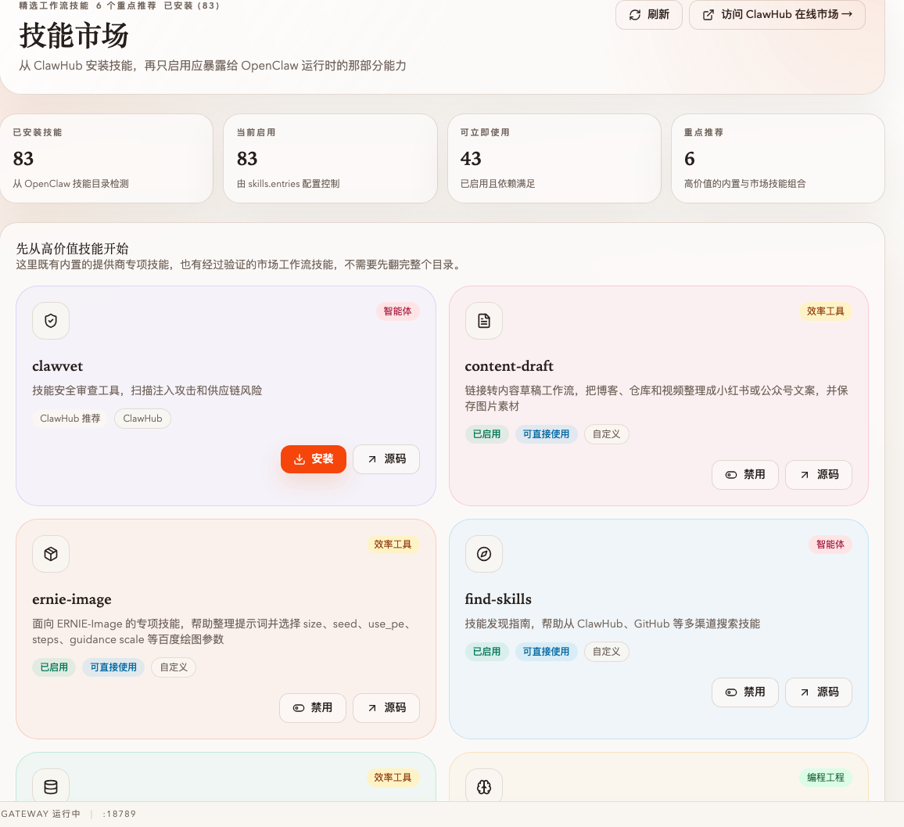
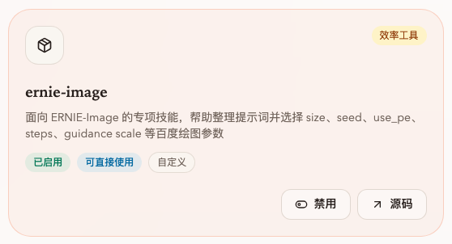
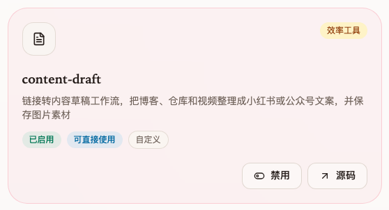
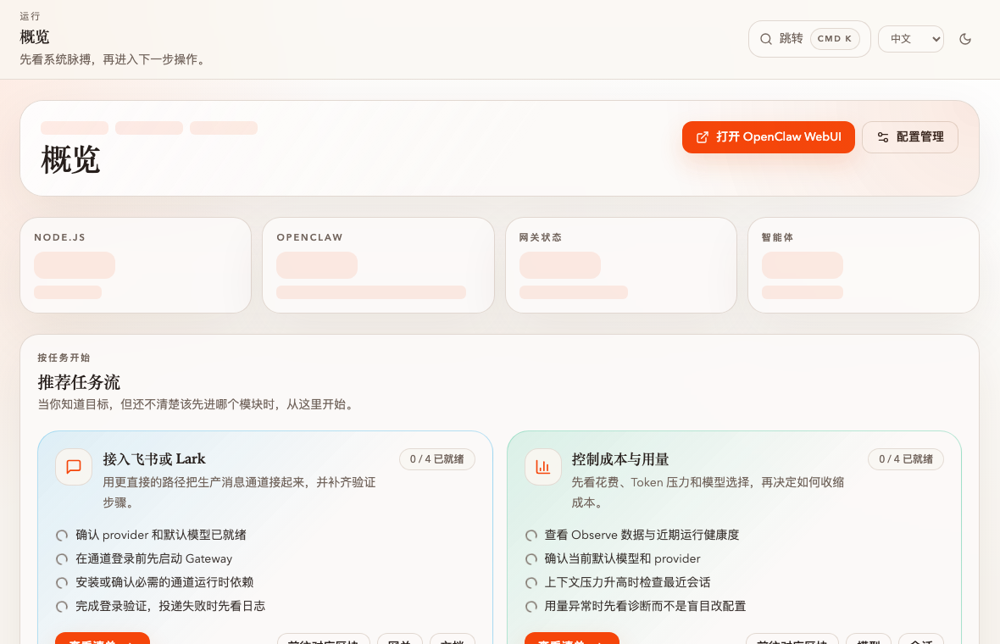
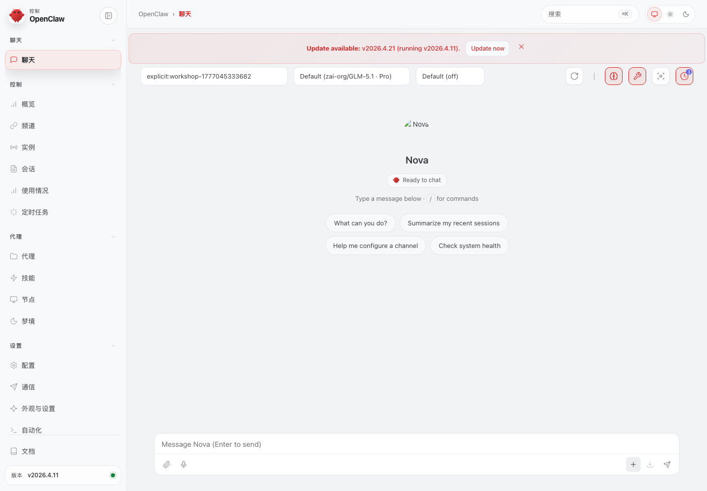
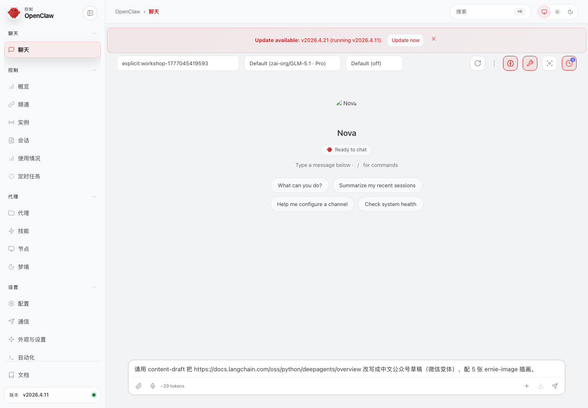
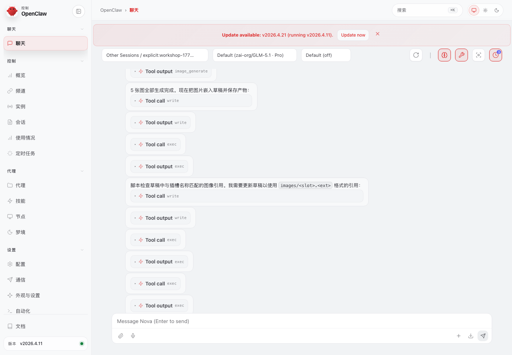
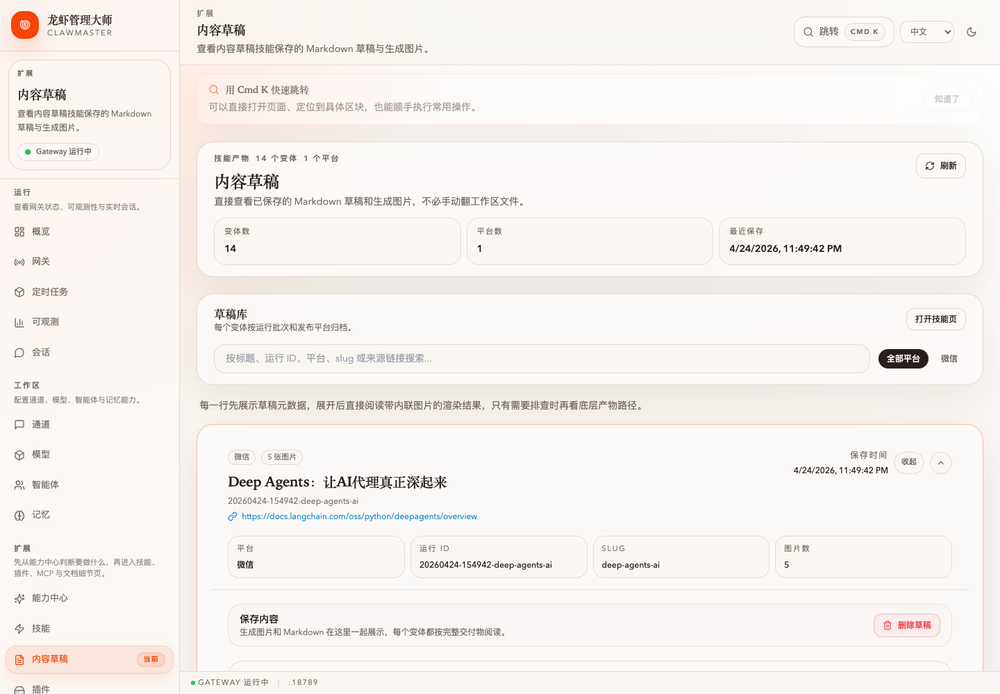
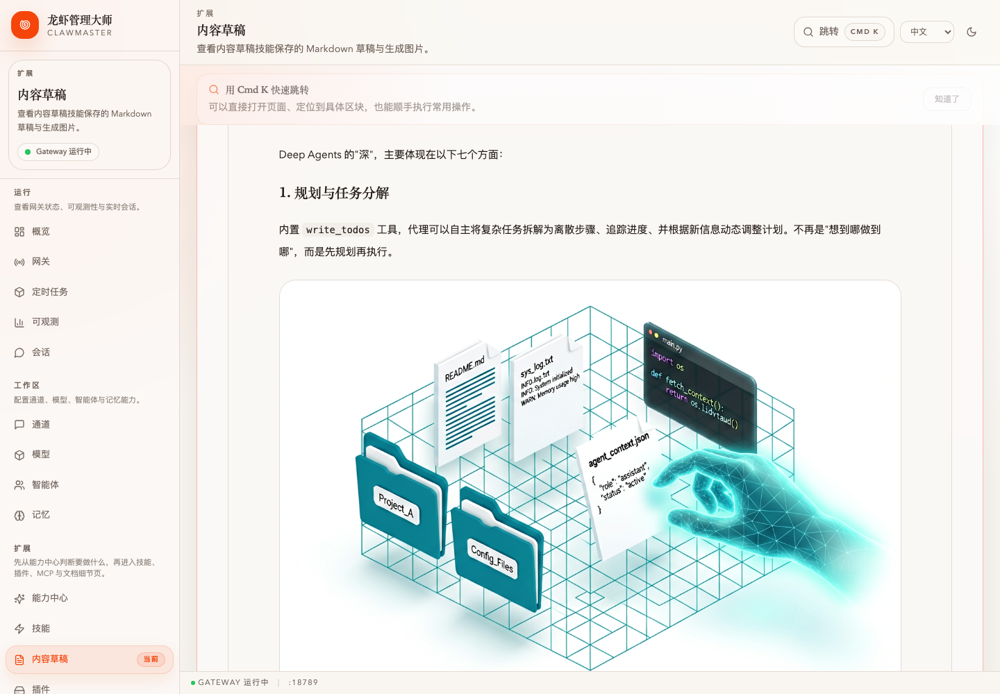
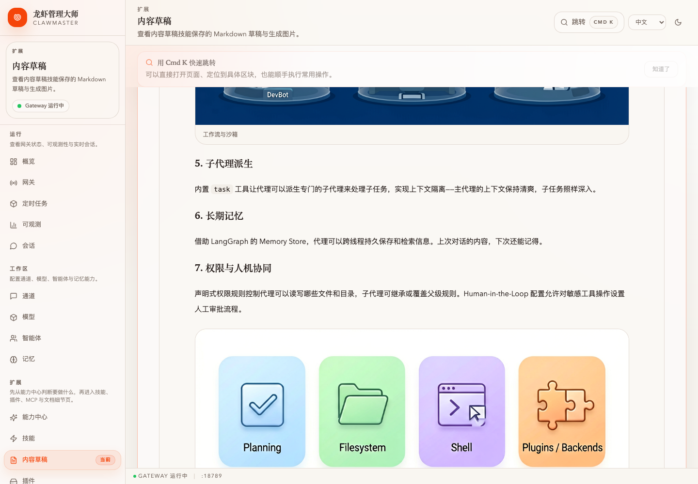

# 任务：用 ernie-image + content-draft 把链接变成带配图的公众号文章

**能力域**：Build · Skills · **用时**：~15 min · **难度**：入门 → 进阶（需先做 [wizard-ernie-glm](../../setup/wizard-ernie-glm/README_CN.md)）

> 确认 `ernie-image` 已就位 → 安装 `content-draft` → 在 OpenClaw 里丢一个 URL，让 Agent 抽正文 + 生成配图 + 存草稿 → 在 ClawMaster 内容草稿页读成品。

> 🌐 English：[README.md](./README.md) · 日本語：[README_JP.md](./README_JP.md)

## 前置条件

1. 已完成 [wizard-ernie-glm](../../setup/wizard-ernie-glm/README_CN.md)（ERNIE 文本模型可用；思考模型如 `ernie-5.0-thinking-preview` 或 `glm-5.1`）
2. 百度 AI Studio 令牌同时对 ERNIE-Image 有效（共享同一枚 key）
3. OpenClaw 网关在 `127.0.0.1:18789` 监听

---

## 第 1 步：确认 ernie-image 就绪

左侧导航 → **技能** → 「先从高价值技能开始」分区：





完成过 wizard 的话，`ernie-image` 卡状态是 **已启用 · 可直接使用**（右下角按钮显示「禁用」就是已启用态）。没启用的话点 **安装**，bundled 技能，1-2 秒完成。

---

## 第 2 步：安装 content-draft

同页面找 **content-draft** 卡，点 **安装**：



`content-draft/SKILL.md` 声明自己是 URL → 草稿 的 repo-owned workflow：收到 URL 时 OpenClaw 会优先走它而不是 `baoyu-*`，配图走 `ernie-image`。

---

## 第 3 步：打开 OpenClaw 控制台

回 **概览** 页，右上角点 **打开 OpenClaw WebUI**：



浏览器带 token 跳到 OpenClaw Chat 视图：



> ⚠️ 401 说明 token 过期或 `gateway.bind` 不是 `127.0.0.1`，回「设置 → 网关」确认。

---

## 第 4 步：把链接丢进去

在 composer 粘贴：

```
基于 https://docs.langchain.com/oss/python/deepagents/overview
帮我生成一篇带配图的微信公众号文章。
目标读者：正在评估 Agent 框架的中文技术开发者。
```



按回车。Agent 会按 `content-draft` 的 7 步 workflow 跑：确认 platform → `fetch-url-markdown.mjs` 抽正文 → `memory_recall` → 写草稿 → `ernie-image` 出图 → `save-draft-artifacts.mjs` → `build-chat-response.mjs`。实时能看到 tool call：



正常 1-3 分钟完成。产物落在 `~/.openclaw/workspace/content-drafts/<run-id>/wechat/`：`draft.md` + `manifest.json` + `images/`。

---

## 第 5 步：在 ClawMaster 读成品

左侧导航 → **内容草稿**：



展开卡片，上半屏是元数据（平台、source URL、run-id、slug、图片数），下半屏是渲染好的 Markdown + 内嵌配图：





顶部动作栏：**复制 Markdown** · **打开图片目录** · **删除变体**。

> 🔎 本次 WebUI 实测产物在 `~/.openclaw/workspace/content-drafts/20260424-154942-deep-agents-ai/wechat/`，`draft.md` 里 5 条 `` 与 `images/` 下的 5 张图片一一对应（`hero` / `concept` / `context` / `workflow` / `capabilities`），`manifest.images[]` 记录每张图的 role + 源路径。

---

## 验证

```bash
LATEST=$(ls -t ~/.openclaw/workspace/content-drafts | head -1)
ls ~/.openclaw/workspace/content-drafts/$LATEST/wechat
# draft.md  manifest.json  images/

jq '{sourceUrl, title, slug}' ~/.openclaw/workspace/content-drafts/$LATEST/wechat/manifest.json
# { "title": "LangChain Deep Agents: ...", "sourceUrl": "...deepagents/overview", "slug": "langchain-deep-agents" }

ls ~/.openclaw/workspace/content-drafts/$LATEST/wechat/images | wc -l  # 5（hero / capabilities / backends / comparison / audience）

# draft.md 里的每条  都能在 images/ 找到同名文件：
grep -oE '!\[[^]]*\]\([^)]+\)' ~/.openclaw/workspace/content-drafts/$LATEST/wechat/draft.md
```

Observe 页能看到主对话 + ernie-image 调用的两条 ClawProbe trace。

---

## 常见问题

**Q：Agent 没调 content-draft，直接写了段文字** → 主对话模型太小或没 tool use。切到思考模型（`ernie-5.0-thinking-preview` / `glm-5.1`），prompt 开头加「请使用 content-draft 技能」。

**Q：出图卡住 > 60 秒** → 百度 AI Studio 对 `ernie-image-turbo` 有并发限制。看 `tool_use` 返回：`rate_limited` 就等 30 秒重发；`invalid_token` 说明 key 没开图像权限，去 <https://aistudio.baidu.com/usercenter/token> 重领。

**Q：内容草稿页空的** → 检查 `OPENCLAW_WORKSPACE_DIR`。自定义过的话草稿在 `$OPENCLAW_WORKSPACE_DIR/content-drafts/`，不是默认 `~/.openclaw/workspace/content-drafts/`。

**Q：同一链接生成 wechat + xhs 两份** → 让 Agent 复用 run-id：`把上一次那条 URL 再按小红书卡片风格做一版，用同一个 run-id`。两份 draft 共享抽取结果。

**Q：换图像后端（本地 SD 等）** → 启用 `image-generate` 技能，prompt 里指定「用 image-generate 生成插图」。

---

## 下一步

- Observe：给这次 run 配 cron 做每日成本摘要 → [cron-cost-digest](../../observe/cron-cost-digest/README_CN.md)
- Save：把「中文技术公众号风格」写进 PowerMem，下次 `memory_recall` 自动套用
