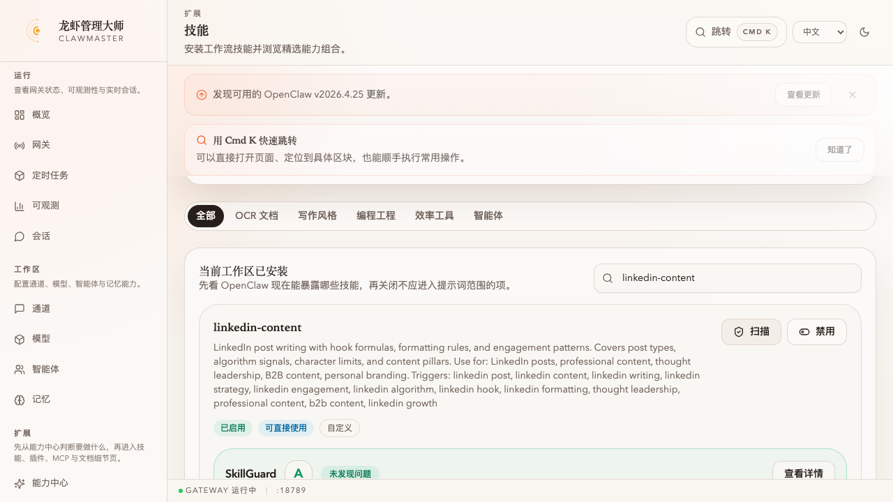
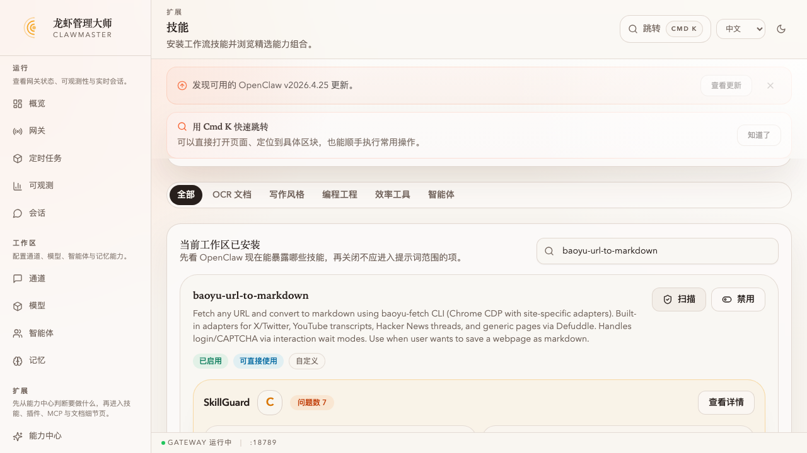
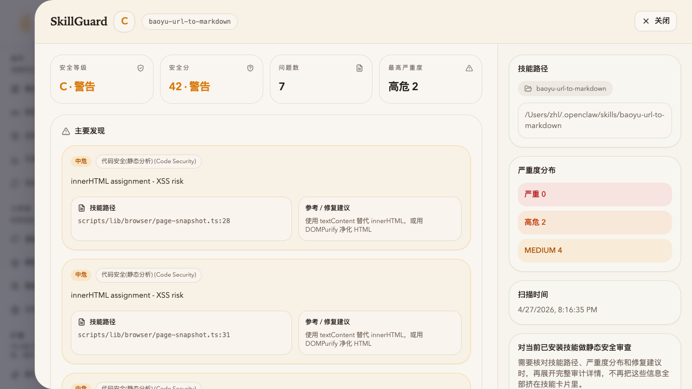

# 任务：用 SkillGuard 对比扫描一条「干净」和一条「有风险」的技能

**能力域**：Guard · **用时**：~6 min · **难度**：入门（需先做 [wizard-ernie-glm](../../setup/wizard-ernie-glm/README_CN.md)）

> 在 ClawMaster 的 **技能** 页分别扫两条本地已安装的技能：一条 `linkedin-content`（A 级 · 0 findings）、一条 `baoyu-url-to-markdown`（C 级 · 7 findings，其中 2 条高危 `exec(`、4 条中危 `innerHTML =`）。对比一次你就知道 SkillGuard 在看什么、为什么不是随便装个技能就能丢给 agent 用。

> 🌐 English：[README.md](./README.md) · 日本語：[README_JP.md](./README_JP.md)

## 前置条件

1. 已完成 [wizard-ernie-glm](../../setup/wizard-ernie-glm/README_CN.md)，ClawMaster 跑在 <http://localhost:16223>
2. 机器里已经装过一批 OpenClaw 技能（比如跟着 baoyu 装了那套）。想完全照我这篇跑的话需要：
   - `linkedin-content`（干净样本）
   - `baoyu-url-to-markdown`（有风险样本）

没装 `baoyu-url-to-markdown`？任何带 `child_process` / `innerHTML =` / `eval()` 的社区技能都可以替代——SkillGuard 的规则是对着代码模式扫的，和具体技能名无关。

---

## 第 1 步：扫「干净」样本 `linkedin-content`

左侧导航 → **技能**。过滤栏里敲 `linkedin-content`，定位到它的卡片，点右上 **扫描**：



卡片下方展开一张 **SkillGuard** 面板：

- **A** · 未发现问题
- **安全分** `0 · 安全`（分数越低越好，0 就是没扣分）
- **安全等级** `A · 安全`
- 右下角时间戳 + 技能名 `linkedin-content`

没有 findings 意味着：
- 代码里没出现 `child_process` / `eval` / `new Function` 之类动态执行
- 没有 `innerHTML =` 这种 DOM-XSS 常见 pattern
- SKILL.md frontmatter 里 **声明了 `allowed-tools`**（按最小权限原则列出这个 skill 会调用的工具）

这就是把一个 skill 挂进 agent 默认可用列表之前想看到的状态。

---

## 第 2 步：扫「有风险」样本 `baoyu-url-to-markdown`

清空过滤器，敲 `baoyu-url-to-markdown`，点 **扫描**：



同一张面板现在换颜色了：

- **C** · **问题数 7**
- **安全分** `42 · 警告`
- **安全等级** `C · 警告`
- 右下角 `高危 2` 徽标

这条技能的工作流是：起一个 Chrome CDP 会话，读取页面 DOM，用 Defuddle 清洗 HTML → 转 markdown。典型的「浏览器自动化 + HTML 拼接」场景，两个风险域都踩到了。

点 **查看详情** 展开全宽 drawer 看具体 findings。

---

## 第 3 步：看详情 drawer



**顶部 4 张卡**：

- 安全等级 `C · 警告`
- 安全分 `42 · 警告`
- 问题数 `7`
- 最高严重度 `高危 2`

**主要发现** 区展示 top 3（按文件顺序），每条带：

- 左上严重度徽标（中危/高危/严重）
- 维度标签，比如 `代码安全(静态分析) (Code Security)`
- 一句话描述（`innerHTML assignment - XSS risk`）
- **技能路径** 精确到行号：`scripts/lib/browser/page-snapshot.ts:28`
- **参考 / 修复建议**：`使用 textContent 替代 innerHTML，或用 DOMPurify 净化 HTML`

下方一行小字 **完整报告中还有 4 条**——包含两条 `HIGH exec(` 和一条 `LOW missing allowed-tools`。想看全部 7 条：

```bash
# CLI 跑一遍拿全量 JSON（backend 跑的就是这条命令）
npm exec --yes @clawmaster/skillguard-cli -- ~/.openclaw/skills/baoyu-url-to-markdown --json
```

输出里 `reports[0].findings` 是全量数组，关键几条：

```text
[5] HIGH     代码安全(静态分析)   exec(
            scripts/lib/media/markdown-media.ts:292
            fix: 避免动态执行代码，改用函数映射 (dict dispatch) 或配置驱动

[6] HIGH     代码安全(静态分析)   exec(
            scripts/lib/media/markdown-media.ts:308
            fix: 避免动态执行代码，改用函数映射 (dict dispatch) 或配置驱动

[7] LOW      权限最小化           missing allowed-tools
            SKILL.md:0
            fix: 在 SKILL.md frontmatter 中声明 allowed-tools 列表
```

**右侧 sidebar**：

- **技能路径**：`/Users/zhl/.openclaw/skills/baoyu-url-to-markdown`（直接用 `code` / `finder` 打开）
- **严重度分布**：`严重 0 · 高危 2 · MEDIUM 4`（LOW 在 sidebar 上省略了，但 top findings 里的「还有 4 条」提示里能找到）
- **扫描时间**：精确到秒（每次扫描都重新跑，不走缓存）

---

## 两条为什么会差这么多？

| 维度 | `linkedin-content` | `baoyu-url-to-markdown` |
|---|---|---|
| 代码类型 | 纯 markdown + frontmatter | TS 脚本 + browser 自动化 |
| 动态代码执行 | 无 | 2× `exec()` |
| DOM / HTML 拼接 | 无 | 4× `innerHTML =` |
| `allowed-tools` frontmatter | 有 | 无 |
| 结果 | **A · 0 findings** | **C · 7 findings** |

不是说 `baoyu-url-to-markdown` 写得烂——浏览器自动化天然要碰这些 API。SkillGuard 的价值是 **让你知道它碰了**，然后由你决定：
- 这个 skill 装进哪个 agent、允许它处理哪些 URL
- 是不是该 fork 一份把 `innerHTML =` 换成 `textContent` / DOMPurify
- 是不是该给 SKILL.md 补一个 `allowed-tools: [browser.page, browser.navigate, ...]` 把它能调的工具锁死

---

## 交叉验证

```bash
# 1) API 路由（ClawMaster UI「扫描」按钮走的就是这条）
curl -sS --noproxy '*' -m 120 -X POST http://localhost:16224/api/skills/scan \
  -H 'Content-Type: application/json' \
  -d '{"slug":"baoyu-url-to-markdown"}' | jq '{riskLevel: .report.riskLevel, score: .report.riskScore, total: .totalFindings, sev: .severityCounts}'

# 2) 直接用 CLI（和 backend 里的完全一致）
npm exec --yes @clawmaster/skillguard-cli -- ~/.openclaw/skills/linkedin-content --json | jq '.reports[0] | {riskLevel, riskScore, findings: (.findings | length)}'

# 3) 确认技能所在路径（SkillGuard 扫的是真实磁盘路径）
ls -la ~/.openclaw/skills/baoyu-url-to-markdown
ls -la ~/.openclaw/workspace/skills/ 2>/dev/null  # workspace-local skills 也会被 SkillGuard 识别
```

---

## 常见问题

**Q：扫描卡在「正在扫描...」不动** → `npm exec --yes @clawmaster/skillguard-cli` 首次运行会去 npm 拉包（~30s）。盯 `packages/backend` 日志看有没有网络错误。

**Q：扫描报 `Installed skill directory not found`** → backend 找不到技能。检查 `~/.openclaw/skills/` 和 `~/.openclaw/workspace/skills/`，或者重启网关让 OpenClaw 重扫。

**Q：drawer 里只显示 3 条 findings，我想看全部** → `completeReport 里还有 N 条` 是设计——UI 只展示 top 3 方便快速定位，全量看 CLI 输出的 JSON。或者按 severity 排序：`jq '.reports[0].findings | sort_by(.severity) | reverse'`。

**Q：`linkedin-content` 真是 A 级？它连 `allowed-tools` 都没声明吧？** → 打开 `~/.openclaw/skills/linkedin-content/SKILL.md` 顶部看 frontmatter。如果里面声明了 `allowed-tools`（或者这条 skill 压根就没用到 agent 工具，只是写作风格指南），规则 `权限最小化` 就通过。A · 0 findings 是可能的。

**Q：SkillGuard 漏掉了什么** → 静态分析只能发现语法级模式。以下几类它都 **发现不了**：
- 运行时拼装（`eval(someFunc.toString())` 这种混淆）
- 通过网络下载的代码（`fetch` 回来再 `new Function`）
- Skills 调用的外部二进制里的风险（比如 `baoyu-fetch CLI` 本身的逻辑不在它扫描范围里）

要防这些，靠的是 **OpenClaw 的 allowed-tools + 沙箱 exec policy + ClawMaster 的渠道审批**，不是单靠 SkillGuard。

**Q：我想让 scan 阻断 install** → 目前 ClawMaster skill 市场的 **安装** 按钮不会先跑 SkillGuard——先装再扫。想在 CI 里做门禁的话，用 CLI 的 `--json` 输出配合 `jq '.reports[0].riskLevel'`，手动把 `D` / `F` 判为拒绝。

---

## 下一步

- Save：看看 `memory_add` 调用链里有没有不该暴露的工具 → [powermem-takeover-file-memory](../../save/powermem-takeover-file-memory/README_CN.md)
- Observe：扫过之后继续监控 agent 实际调了哪些 tool，用 cron 自动出 digest → [cron-cost-digest](../../observe/cron-cost-digest/README_CN.md)
- Guard 续作：给你自己写的 skill 补 `allowed-tools`，重扫一次看 score 从多少降到多少（待建）
