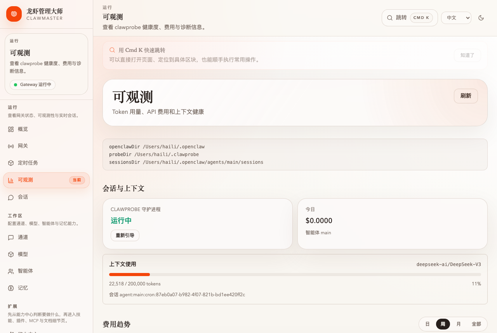
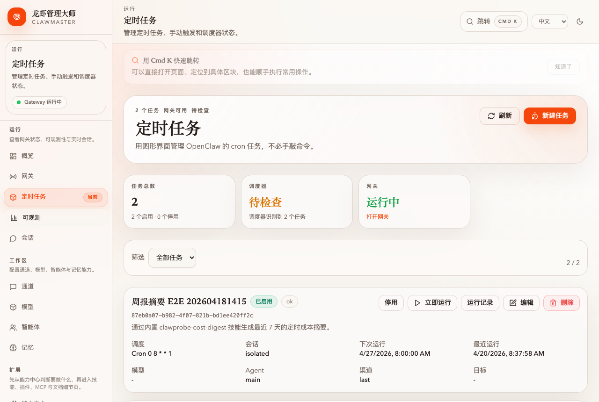
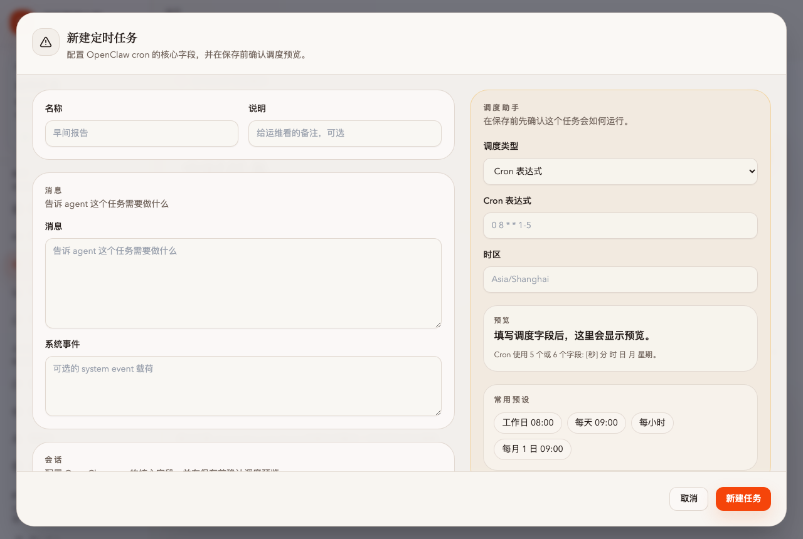
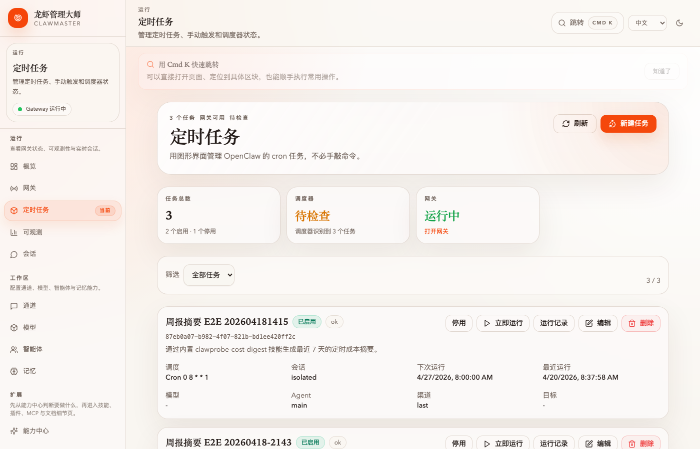
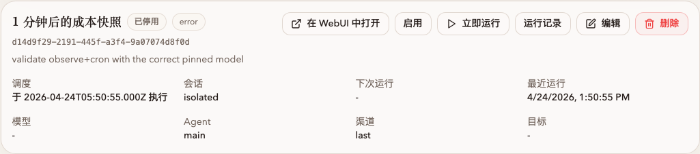
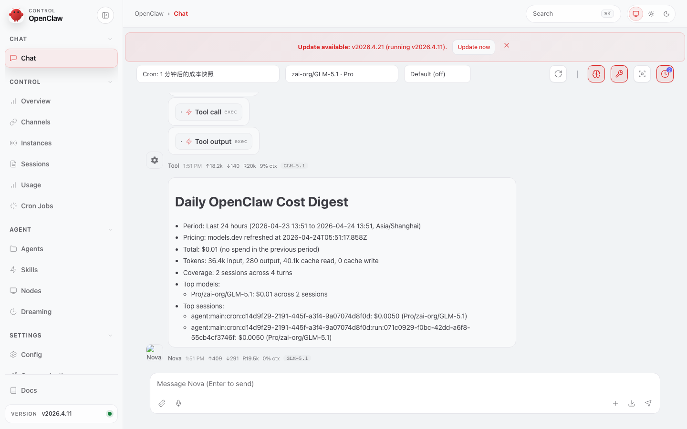
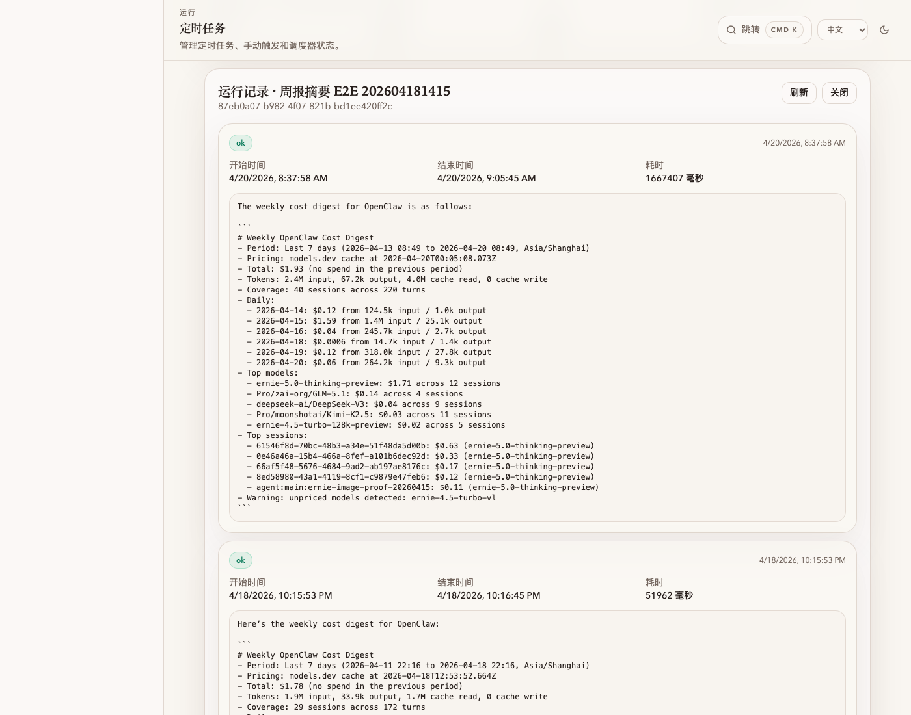
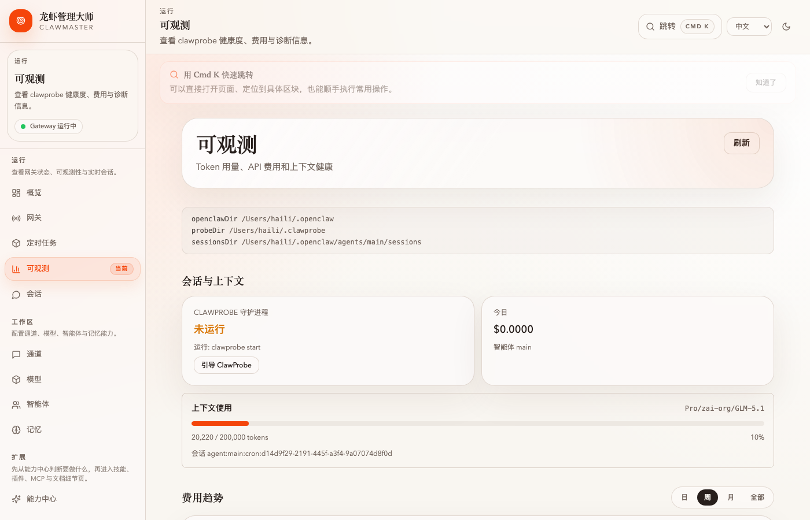
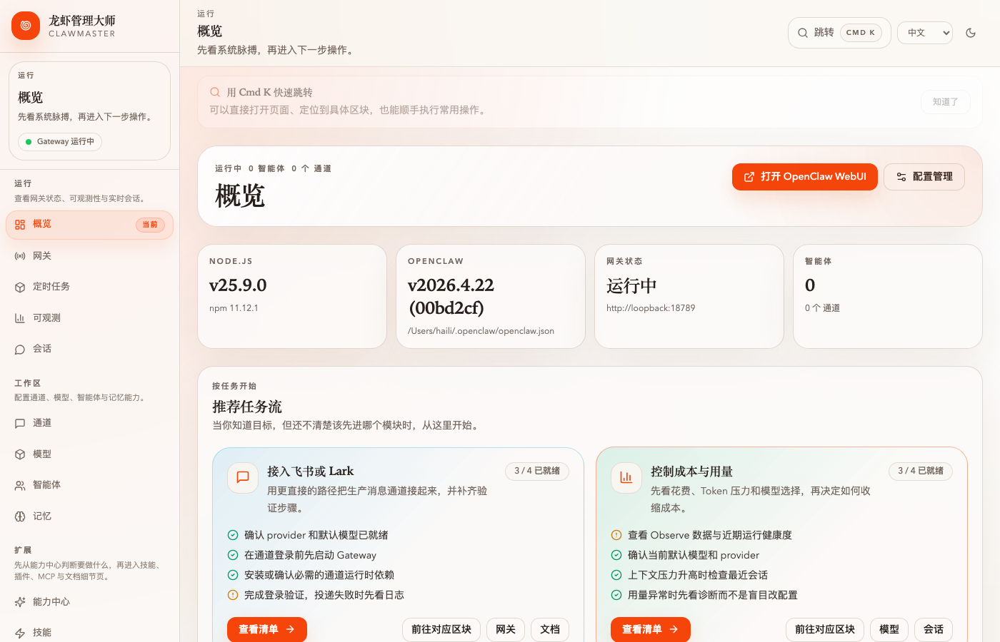
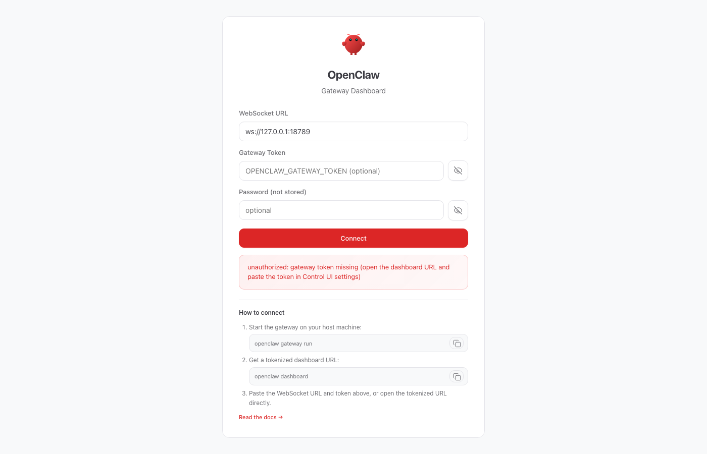

# 任务：启用 Observe + 单次 cron 抓一次 ClawProbe 成本摘要

**能力域**：Observe + Cron · **用时**：~8 min · **难度**：入门（需先做 [wizard-ernie-glm](../../setup/wizard-ernie-glm/README_CN.md)）

> 启用可观测模块，再用单次 cron 让 Agent 在 1 分钟后调用 `clawprobe-cost-digest` 技能生成当日成本摘要。

## 前置条件

1. 已完成 [wizard-ernie-glm](../../setup/wizard-ernie-glm/README_CN.md)，默认模型可用
2. ClawMaster 控制台在跑
3. Gateway 已启动（cron 执行的前提；在「网关」页一键开）

---

## 第 1 步：启用 ClawProbe

左侧导航 → **可观测**。没装的话会看到空状态 + **「安装并启动 ClawProbe」** 按钮：



点一下即可（走 `npm i -g clawprobe && clawprobe start`）。或者 CLI：

```bash
npm i -g clawprobe && clawprobe start
```

装完状态变 **「ClawProbe 运行中」**，页面开始显示 token / 成本卡片。

> 💡 ClawProbe 是独立 Node 守护进程：订阅 OpenClaw 会话事件、用 models.dev 查定价、把每次调用写进 `~/.clawprobe/probe.db`（SQLite），Observe 页只读它。

---

## 第 2 步：打开「定时任务」页

左侧导航 → **定时任务**，右上角 **「+ 新建任务」**。



---

## 第 3 步：填表



| 字段 | 值 |
|---|---|
| 名称 | `1 分钟后的成本快照` |
| 调度类型 | **单次任务**（下拉菜单切换，表单会从 cron 表达式变成「运行时间」） |
| 运行时间 | 现在 +80 秒的 ISO 串（见下） |
| 模型 | **显式填** 你当前用的 ID，例如 `siliconflow/Pro/zai-org/GLM-5.1` |
| 消息 | 见下方 prompt |

生成运行时间：

```bash
python3 -c "import datetime as d; t=d.datetime.now().astimezone()+d.timedelta(seconds=80); print(t.isoformat(timespec='seconds'))"
# 2026-04-24T13:07:39+08:00
```

> ⚠️ ISO 串必须带时区偏移（`+08:00`），否则跨时区部署会偏。

Prompt：

```
使用已安装的 clawprobe-cost-digest 技能生成最近 24 小时的 OpenClaw 日成本摘要。先读取该技能，再运行 `node ${SKILL_DIR}/scripts/generate-digest.mjs --period day --summary`，最终只返回脚本生成的 markdown 摘要。不要编造数字，也不要额外扩写。
```

> ⚠️ **模型字段一定要显式填**。cron 会把创建时的模型永久固化，不跟随 `agents.defaults.model.primary` 变。留空也能跑，但换默认模型后这条 cron 仍用旧值。

右侧「调度助手」预览应显示 **「约 1 分钟后运行一次」**。点 **「新建任务」** 提交。

---

## 第 4 步：等它触发



「下次运行」倒数到 0，「最近运行」变「刚刚」并附 🟢/🔴 徽标。

> ⚠️ 没配渠道时 Delivery 会报 "Channel is required"——摘要**已生成**，只是没投递。要避免报错就在创建时选 `last` 或指定通道。

---

## 第 5 步：查看结果

展开 cron 卡片，看到操作按钮：**在 WebUI 中打开** · 启用/停用 · 立即运行 · 运行记录 · 编辑 · 删除。



### 5.1 「在 WebUI 中打开」——完整会话

点 **「在 WebUI 中打开」**，新标签页深链到 cron 对应的 OpenClaw 会话，token 自动带上：


能看到每一条 Nova / Tool 气泡（时间戳、tokens、模型）、完整的 `Tool call / Tool output` 调用序列、底部独立卡片渲染的 `Daily OpenClaw Cost Digest`：



排查「cron 产出跟预期不一样」基本只看这里。Session key 推导逻辑在 [CronPage.tsx:128](https://github.com/openmaster-ai/clawmaster/blob/main/packages/web/src/modules/cron/CronPage.tsx#L128) 的 `resolveCronWebUiSessionKey()`。

### 5.2 「运行记录」抽屉——快速一瞥



开始/结束时间、耗时、stdout（最终 markdown 摘要）、退出码。不含 tool 调用细节，好处是不离开 ClawMaster 窗口。

示例输出：

```markdown
# Daily OpenClaw Cost Digest
- Period: Last 24 hours (2026-04-23 13:51 to 2026-04-24 13:51, Asia/Shanghai)
- Total: $0.01 (no spend in the previous period)
- Tokens: 36.4k input, 280 output, 40.1k cache read
- Top models: Pro/zai-org/GLM-5.1: $0.01 across 2 sessions
```

---

## 交叉验证

```bash
# ClawProbe 当日数据
curl -sS --noproxy '*' http://localhost:16223/api/clawprobe/cost?period=day | jq

# 直接跑技能脚本
SKILL_DIR=$(find ~/.openclaw/skills -maxdepth 2 -name 'clawprobe-cost-digest' -type d | head -1)
node "$SKILL_DIR/scripts/generate-digest.mjs" --period day --summary

# 最近活跃 session（可能是这条 cron）
curl -sS --noproxy '*' http://localhost:16223/api/clawprobe/status | jq '{sessionKey, model, todayUsd}'
```

回 Observe 页，「今日花费」会把这次 cron 计入，「模型费用分布」里能看到你 pin 的模型占主位：



---

## 后续玩法

- **改周期**：编辑任务 → Cron 表达式 `0 8 * * *` 每天 08:00
- **投递**：在 **渠道** 选飞书/Slack，摘要自动推送
- **周/月版**：Observe 页 **「打开 Cron 任务」** 有 Daily / Weekly / Monthly 预设

---

## 常见问题

**Q：新建任务「下次运行」一直 `—`** → Gateway 没启动，去「网关」页开。

**Q：stdout 是空的** → `clawprobe-cost-digest` 技能没启用，或 ClawProbe 今天还没记过任何会话（先在 Agent 里聊一句让 probe 收一次数据）。

**Q：`clawprobe status` 显示的模型不是我的默认模型** → 不是 bug。`status` 返回最近活跃 session；cron session 会固化创建时的模型。诊断：

```bash
sqlite3 -header -column ~/.clawprobe/probe.db \
  "SELECT session_key, model FROM session_snapshots ORDER BY sampled_at DESC LIMIT 10;"
```

如果最上面是 `agent:main:cron:<uuid>` 且模型不对 → 回 `/cron` 改那条 cron 的 `模型` 字段再「立即运行」。

**Q：「在 WebUI 中打开」是灰的** → `resolveCronWebUiSessionKey()` 推导不出 key。条件：显式 `sessionKey` / `session=main` / `session=isolated` 且 `lastRun` 非空。解决：点 **「立即运行」** 让它先跑一次；或创建时就显式填 `sessionKey`。

**Q：想纵览所有 cron 的 session** → 概览页的 **「打开 OpenClaw WebUI」** 进 Dashboard，Sessions 标签按 `agent:main:cron:` 过滤。

 

Token 失效时终端跑 `openclaw dashboard` 拷一个过来。

**Q：秒级调度** → Cron 表达式支持 6 字段（第一段是秒）。单次任务的 ISO 串本身就精确到秒。
