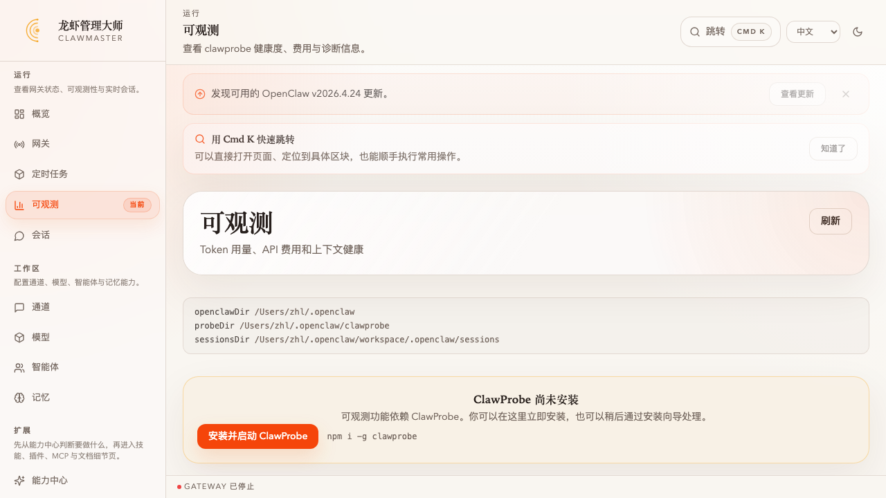
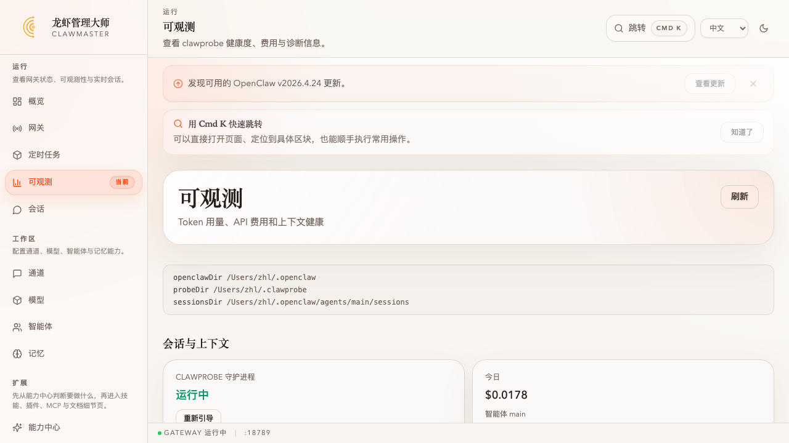
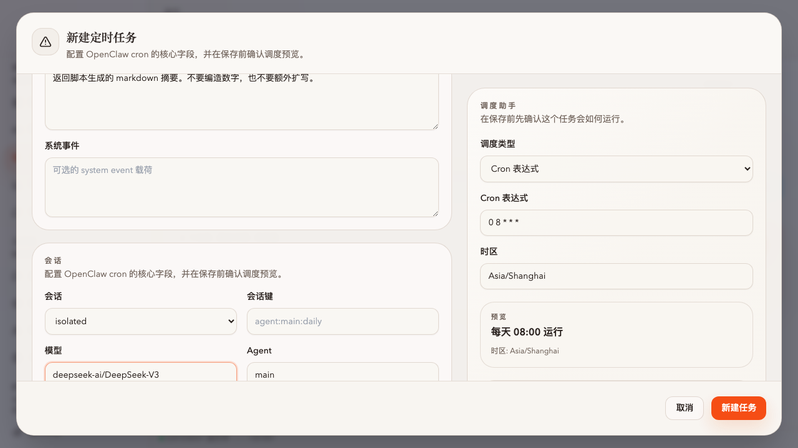
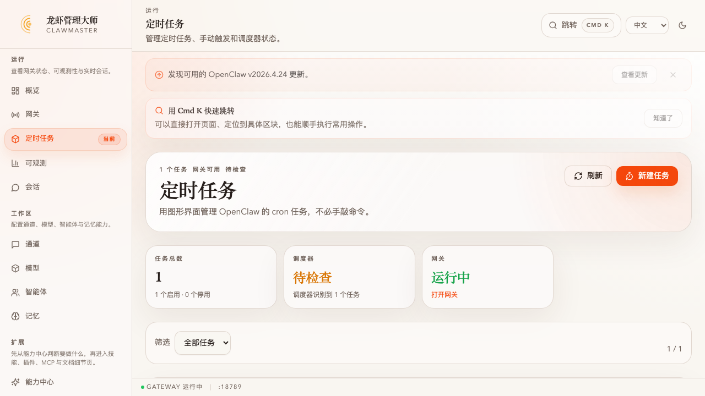
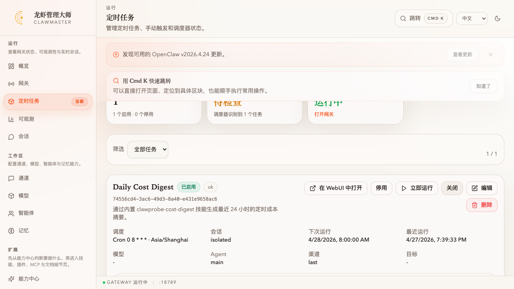
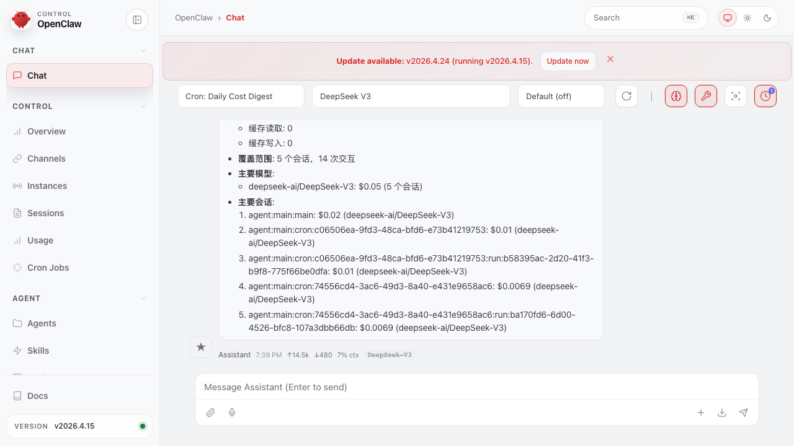

# 任务：装 ClawProbe，用日报模板起一条成本摘要 cron

**能力域**：Observe + Cron · **用时**：~8 min · **难度**：入门（需先做 [wizard-ernie-glm](../../setup/wizard-ernie-glm/README_CN.md)）

> 装好 ClawProbe → 让 agent 跑两句对话让「最新会话」卡片先亮起来 → 在可观测页直接点 **日报摘要** 模板 → 提交 → **立即运行** 一次看产出 → 回到可观测页看「最新会话」卡片已经跟上这次 cron → 打开 WebUI 看 tool call 流水。一条 end-to-end 的 Observe × Cron 闭环。

> 🌐 English：[README.md](./README.md) · 日本語：[README_JP.md](./README_JP.md)

## 前置条件

1. 已完成 [wizard-ernie-glm](../../setup/wizard-ernie-glm/README_CN.md)，ClawMaster 跑在 <http://localhost:16223>
2. 网关在跑（可观测页和定时任务页右下角会有「GATEWAY 运行中」徽标）
3. 还没装 ClawProbe（或者你想装干净一次）

---

## 第 1 步：打开可观测页，看到空状态

左侧导航 → **可观测**。没装 ClawProbe 时页面是空态：



「会话与上下文」卡片显示 **CLAWPROBE 守护进程 未运行** + 「引导 ClawProbe」按钮。「最新会话」卡是 **无活跃会话**。下方 **定时成本摘要** 三张预设（日/周/月）也是灰的——这是设计：没 probe 就没数据，cron 出来也是空。

点「引导 ClawProbe」或走命令行二选一：

```bash
npm i -g clawprobe && clawprobe start
```

---

## 第 2 步：让最新会话卡片跑起来（1 分钟）

装完后页面不会突然变好看，因为 **你今天还没有任何 agent 会话**。在另一个终端里随便问一句：

```bash
openclaw agent -m "用一句话告诉我今天要不要带伞" --agent main --local
```

回可观测页点刷新（或直接看头部「今日」卡片跳到 $0.0xxx）。**最新会话** 这张卡就是这次要看的重点：



卡片里 6 个字段全部来自 ClawProbe：

- **活跃** 徽标 + `siliconflow / deepseek-ai/DeepSeek-V3`
- **会话费用** $0.0178（用 models.dev 的价格算的，不用自己查）
- **输入 / 输出** 70,344 / 221 tokens
- **最近活跃** 具体时间
- **上下文使用** 18,493 / 200,000 Token（9%）
- **会话 key** `agent:main:main`

这张卡是「写代码过程里成本突然飙升」「context 快满了」这两种问题的第一个现场。

> ⚠️ 如果「今日 $0.00」但 token 有数字，多半是 ClawProbe 对你当前的 `provider/model` 找不到价格。打开 `~/.clawprobe/config.json`，在 `cost.customPrices` 里补一行 `"siliconflow/deepseek-ai/DeepSeek-V3": { "input": 0.25, "output": 1 }` 即可（单位 USD / 1M tokens），重启 `clawprobe stop && clawprobe start`。

---

## 第 3 步：用 **日报摘要** 模板开一条 cron

滚动到页面底部 **定时成本摘要** 区，点 **日报摘要 → 在 Cron 中打开**：



URL 走到 `/cron?template=cost-digest&period=day`，表单全部预填：

| 字段 | 值 |
|---|---|
| 名称 | `Daily Cost Digest` |
| 说明 | `通过内置 clawprobe-cost-digest 技能生成最近 24 小时的定时成本摘要。` |
| 消息 | `clawprobe-cost-digest` 技能的完整 prompt（调 `node ${SKILL_DIR}/scripts/generate-digest.mjs --period day --summary`） |
| 会话 | `isolated`（每次跑都开独立会话，不污染 main）|
| Agent | `main` |
| 调度类型 | **Cron 表达式** · `0 8 * * *` |
| 时区 | `Asia/Shanghai`（读的是浏览器 tz） |

右侧「调度助手」预览 **每天 08:00 运行**。

**唯一要手填的是 `模型` 字段**：塞 `siliconflow/deepseek-ai/DeepSeek-V3`（**一定带 `provider/` 前缀**，否则 cron 跑起来会 `FailoverError: Unknown model`——cron 走网关路由，不像 `--local` 自己猜 provider）。

> ⚠️ 把 **「将摘要发送到渠道」** 先取消掉，否则没配 channel 时第一次运行会报 `Channel is required`。等配好飞书/Telegram 再来打开。

点 **新建任务**。回到列表看到新 cron：


---

## 第 4 步：**立即运行** 看一次产出

日报 cron 的下次触发是明早 08:00，不等。点卡片里的 **立即运行**：

- 状态徽标变 **ok**（60~90 秒跑完）
- **最近运行** 显示刚才的时间
- **在 WebUI 中打开** 按钮亮起来



点 **运行记录** 打开抽屉，直接看 stdout：



抽屉里 **摘要** 就是 `clawprobe-cost-digest` 技能脚本输出的原文，例子：

```markdown
### 每日 OpenClaw 成本摘要
- 时间段: 2026-04-26 19:39 至 2026-04-27 19:39 (Asia/Shanghai)
- 定价来源: 缓存于 2026-04-27T11:32:37.242Z
- 总成本: $0.05 (上一周期无支出)
- 总 token:
  - 输入: 206.2k · 输出: 1.2k · 缓存读取/写入: 0/0
- 覆盖范围: 5 个会话，14 次交互
- 主要模型: deepseek-ai/DeepSeek-V3: $0.05 (5 个会话)
- 主要会话:
  1. agent:main:main: $0.02
  2. agent:main:cron:74556cd4-...:run:ba170fd6-...: $0.0069
```

---

## 第 5 步：「在 WebUI 中打开」看 tool call 流水

点卡片上的 **在 WebUI 中打开**，新标签页直达 OpenClaw 自带聊天界面，带着 cron 专属的 `session` 参数和网关 token：



能看到这次 cron 真正干了什么：

1. **Tool call: read** — 读 `clawprobe-cost-digest` 技能的 SKILL.md
2. **Tool output: read** — 拿到技能说明
3. **Tool call: exec** — `node ${SKILL_DIR}/scripts/generate-digest.mjs --period day --summary`
4. **Tool output: exec** — 脚本输出的 markdown
5. **Assistant** — 返回 markdown 摘要 · token ↑14.5k / ↓480 · 7% ctx · DeepSeek-V3

「为什么 cron 结果跟预期不一样」的排查路径就是这个页面：看是 skill 没读对、脚本报错了、还是最后模型改写了内容。

---

## 第 6 步：回可观测页，确认闭环

返回 **可观测** 页看看数据怎么流回来的：


三处变化：

1. **今日费用** 从 $0.0178 → $0.0394（刚才 cron 烧的 tokens 都进来了）
2. **费用趋势 > 2026-04-27** 柱子长了一截
3. **最新会话** 卡从 `agent:main:main` 切到了 `agent:main:cron:74556cd4-...:run:ba170fd6-...`——因为 cron 的 run session 是最近活跃的

这就是整个链路：

```
agent 对话/cron 执行
      ↓
  OpenClaw 写 sessions/*.jsonl
      ↓
  ClawProbe 守护进程抓 jsonl → probe.db
      ↓
  /api/clawprobe/{status,cost,session} ← ClawMaster 后端代理 CLI
      ↓
  可观测页 3 张卡（今日 / 最新会话 / 费用趋势）
```

cron 是这条链路的入口之一，probe 是终点。

---

## 交叉验证

```bash
# 1) 今日成本（和「今日」卡片一致）
curl -sS --noproxy '*' http://localhost:16224/api/clawprobe/cost?period=day | jq '{totalUsd, inputTokens, outputTokens, daily: .daily[0]}'

# 2) 最新会话详情（和「最新会话」卡片一致）
clawprobe session agent:main:cron:<jobId>:run:<runId> --agent main --json | jq '{model, provider, estimatedUsd, contextTokens, turns: .turns | length}'

# 3) cron 最近一次运行（和「运行记录」抽屉一致）
openclaw cron runs --id <jobId> --limit 1 | jq '.entries[0] | {status, durationMs, summary: .summary[0:200]}'

# 4) 不用打开 UI 也能跑一次
openclaw cron run <jobId>

# 5) 技能脚本手动跑一遍对一下输出
SKILL_DIR=$(find ~/.openclaw/workspace/skills -maxdepth 2 -name 'clawprobe-cost-digest' -type d | head -1)
node "$SKILL_DIR/scripts/generate-digest.mjs" --period day --summary
```

---

## 后续玩法

- **换调度**：日报不够用时，编辑任务，**调度类型** 切到 **固定间隔 · 1h**——适合压测阶段密切盯成本
- **周报 / 月报**：可观测页底部还有 **周报摘要** / **月报摘要** 两张预设，点一下同样是预填模板
- **投递**：配好飞书/Telegram 后回到这条 cron，**编辑 → 勾选 将摘要发送到渠道 → 填 channel**，摘要每天 08:00 自动推给值班群
- **扩展技能**：自己写一个 `clawprobe-budget-alert` skill（超 5 USD/天 就 @你），继续接到 cron 上

---

## 常见问题

**Q：cron 跑完状态 `ok` 但「今日」卡片没变** → 手动点一下可观测页右上角 **刷新**；或 probe 还在 debounce 还没把 jsonl 写进 db，等 10 秒再看。

**Q：cron 报 `FailoverError: Unknown model: deepseek-ai/DeepSeek-V3`** → 模型字段没带 provider 前缀。正确写法 `siliconflow/deepseek-ai/DeepSeek-V3`。也可以直接留空让它用默认模型（`openclaw config get agents.defaults.model.primary` 看看是什么）。

**Q：cron 报 `Channel is required`** → **将摘要发送到渠道** 开着但没配 channel。两种解法：① 编辑任务取消这个勾 / 或 `openclaw cron edit <id> --no-deliver`；② 先去 **渠道** 页配一个 Telegram/飞书/iMessage，然后 channel 填 `last`。

**Q：「今日 $0.00」但 token 有数字**（unpriced 告警） → 打开 `~/.clawprobe/config.json`，`cost.customPrices` 下加一行。models.dev 的价是 USD/1M tokens，直接拷就行：

```json
{
  "cost": {
    "customPrices": {
      "siliconflow/deepseek-ai/DeepSeek-V3": { "input": 0.25, "output": 1 }
    }
  }
}
```

然后 `clawprobe stop && clawprobe start`——**不要** `clawprobe reset-db`，会把历史数据删光。

**Q：「在 WebUI 中打开」灰着** → cron 的 `lastRun` 还没产生。点一次 **立即运行** 先让它跑一次；或者创建时就 **session=main** / 显式 `sessionKey`。

**Q：想同时看所有 cron 的 session** → 概览页 **「打开 OpenClaw WebUI」** → Sessions 标签 → 按 `agent:main:cron:` 前缀过滤。

**Q：为什么不是 1 分钟后单次触发？** → 早前版本就是单次 + 80s 延迟。问题有俩：① 1 分钟太短，没时间让你换到别的页再回来对比；② 单次任务跑完就消失了，学到的 cron 技能没沉淀成「日常会用的东西」。现在用日报 + 立即运行：**日常真实用法（每天 08:00 一次）** + **立刻就能看到效果（不用等）**。

---

## 下一步

- Save：给不同 agent / user 分区存记忆，观察 PowerMem 按 scope 隔离 → [powermem-takeover-file-memory](../../save/powermem-takeover-file-memory/README_CN.md)
- Setup：忘了怎么配 provider？→ [wizard-ernie-glm](../../setup/wizard-ernie-glm/README_CN.md)
- Build 续作：给 `content-draft` 配条小时级 cron，自动产出当日选题 → 待建
