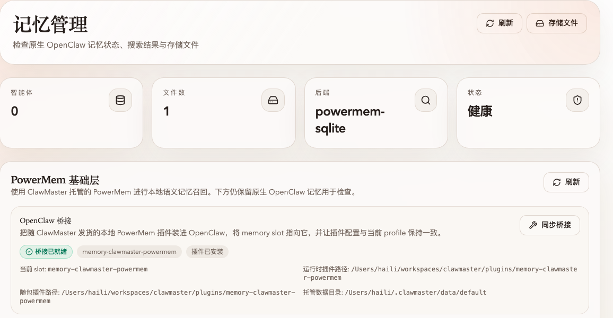
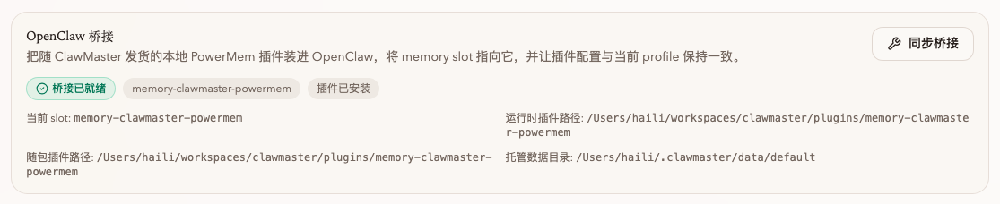
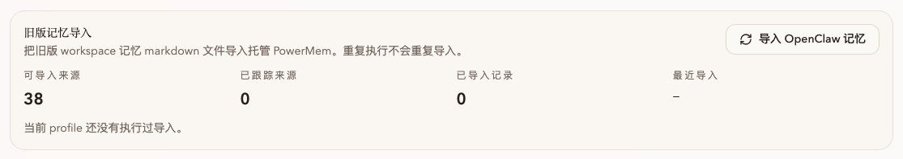
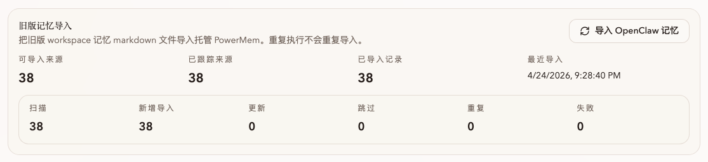
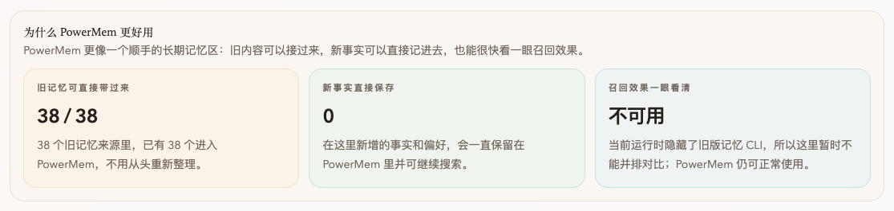

# 任务：让 PowerMem 接管 OpenClaw 的文件式记忆

**能力域**：Save · **用时**：~8 min · **难度**：入门（需先做 [wizard-ernie-glm](../../setup/wizard-ernie-glm/README_CN.md)）

> 同步 OpenClaw 桥接 → 一键导入 `~/.openclaw/workspace/MEMORY.md` + `memory/*.md` → 把 grep 式搜索升级成向量召回。完成后新的 `memory_add` 直接写入托管 PowerMem，不再回写文件。

> 🌐 English：[README.md](./README.md) · 日本語：[README_JP.md](./README_JP.md)

## 前置条件

1. 已完成 [wizard-ernie-glm](../../setup/wizard-ernie-glm/README_CN.md)
2. OpenClaw workspace 里已经有文件式记忆。没有就跑一条命令先种几个：

   ```bash
   mkdir -p ~/.openclaw/workspace/memory
   cat > ~/.openclaw/workspace/MEMORY.md <<'EOF'
   # 长期记忆索引
   - [用户角色](user_role.md) — 深圳线下工作坊组织者
   - [写作偏好](writing_style.md) — 中文技术内容，偏工程实证
   EOF
   cat > ~/.openclaw/workspace/memory/user_role.md <<'EOF'
   ---
   name: 用户角色
   type: user
   ---
   组织 ClawMaster + OpenClaw 线下工作坊，目标受众是产品经理与 AI 开发者。
   EOF
   cat > ~/.openclaw/workspace/memory/writing_style.md <<'EOF'
   ---
   name: 写作偏好
   type: feedback
   ---
   文章要短，先给结论再给数据。不要把 "新特性" 当亮点写。
   EOF
   ```

---

## 第 1 步：打开记忆页

左侧导航 → **记忆**。顶部四张汇总卡 + 下方 **PowerMem 基础层** 大板块：



---

## 第 2 步：确认 OpenClaw 桥接

「OpenClaw 桥接」子卡展示 OpenClaw 的 memory slot 是否指向随 ClawMaster 发货的 `memory-clawmaster-powermem` 插件。完成过 setup 向导的话，这里默认就是 **桥接已就绪**：



右上角 **同步桥接** 按钮任何时候都能再点一次；`openclaw.json` 被改乱 / profile 切换后 dataRoot 漂移时，状态会变成 **需要同步**，**待处理问题** 列表会指出哪项字段不一致，点按钮就会重写 slot + config，回到就绪态。

底部四行分别是当前 slot / 运行时插件路径 / 随包路径 / 托管数据目录，全部指向 `~/.clawmaster/data/<profile>/memory/powermem/`。

> ⚠️ 状态一直 **当前不支持** → 说明是 web-only 模式。桌面/Tauri 模式下才会激活托管运行时。

---

## 第 3 步：一键导入文件式记忆

桥接就绪后「旧版记忆导入」区块的按钮可用。**可导入来源** 栏是扫描 workspace 得到的 `MEMORY.md + memory/**/*.md` 数量，**已导入记录** 初次是 0：



点 **导入 OpenClaw 记忆**：扫描 `~/.openclaw/workspace/MEMORY.md` + `memory/**/*.md` → 按 `(agentId, path, content)` 算 SHA-256 指纹 → 存成 PowerMem 记录。重复执行只会 `skipped`，改动文件会 `updated`，删除文件会级联删除对应记录。



**最近运行** 行展开六项：扫描 / 新增导入 / 更新 / 跳过 / 重复 / 失败。第二次点同一个按钮，六项应该全在 `跳过`。

> 💡 导入是 **幂等** 的。指纹写在 `~/.clawmaster/data/<profile>/memory/powermem/openclaw-import-state.json`。

---

## 第 4 步：验证接管效果

「为什么 PowerMem 更好用」三张色块证据卡：



- **旧记忆可直接带过来**（琥珀色）：`N/N` — workspace 下的 markdown 记忆一次性都进来了，不用重整理
- **新事实直接保存**（翠绿色）：在 UI 或 `memory_add` 新增、**不回写 markdown** 的记录数；下次搜索就能命中
- **召回效果一眼看清**（天蓝色）：运行时暴露 `openclaw memory` 子命令时，这里会变成同查询并排对比（PowerMem 语义 vs CLI grep）；新版 CLI（`2026.4.22+`）下线了该子命令，所以显示 **不可用** + 「PowerMem 仍可正常使用」。

第三张卡「不可用」本身就是「文件式记忆该让位」的信号——CLI 搜索都不再维护了，UI 侧的语义召回是唯一通路。

---

## 验证

```bash
# 桥接指向随包插件
jq '.plugins.slots, .plugins.installs["memory-clawmaster-powermem"]' ~/.openclaw/openclaw.json
# { "memory": "memory-clawmaster-powermem" }
# { "source": "path", "installPath": ".../plugins/memory-clawmaster-powermem", ... }

# 导入状态 — 每个 markdown 按 (agentId, path, content) 指纹单独一行
jq '.lastRun, (.sources | length)' \
  ~/.clawmaster/data/default/memory/powermem/openclaw-import-state.json

# PowerMem SQLite 数据
sqlite3 ~/.clawmaster/data/default/memory/powermem/powermem.sqlite \
  "SELECT COUNT(*), MIN(created_at), MAX(created_at) FROM memories;"

# 走托管 stats API 快速确认条目数
curl -sS --noproxy '*' http://localhost:16223/api/memory/managed/stats \
  | jq '{totalMemories, userCount, engine}'
```

---

## 常见问题

**Q：点「同步桥接」后仍报 `drifted`** → 下方 **待处理问题** 列表会点明是哪个字段漂移。多数情况是 `dataRoot` 被其他 profile 改过，把 ClawMaster 设置里的 profile 切过去再同步一次即可。

**Q：导入 `failed > 0`** → 打开 `openclaw-import-state.json`，对照 `sources` 里哪些条目没拿到 `memoryId`。最常见是空文件或只有 frontmatter 没正文，修完再点一次按钮。

**Q：我又在 Claude Code / OpenClaw 里写了新 MEMORY** → 桥接不会实时监听文件系统，回来再点一次 **导入 OpenClaw 记忆** 即可。指纹没变的 skipped，内容变了 updated。

**Q：删除了一个 `memory/*.md` 会怎样** → 下次导入时 workspace 扫不到那个 key，托管记录会级联删除，不会留孤儿。

**Q：召回对比那栏灰着** → 当前运行时没暴露 `openclaw memory` 命令（比如纯 web 模式），页面会把旧版搜索自动隐藏。只看语义搜索栏就行。

---

## 下一步

- Save 续作：在 **搜索托管 PowerMem 记忆** 里直接 `+ 添加记忆` 一条"中文技术公众号风格"，不再回写 `memory/*.md`
- Build：让 `content-draft` 的 `memory_recall` 命中你刚迁移的"写作偏好"，生成的草稿自动按风格套板
