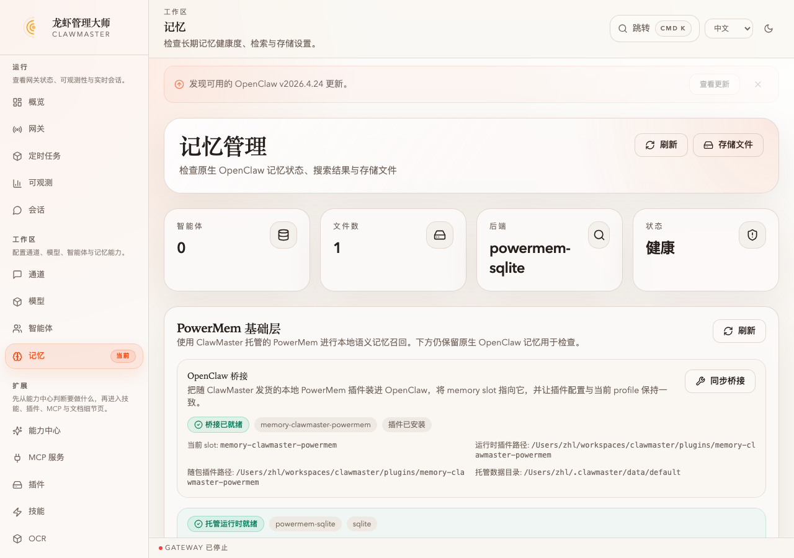
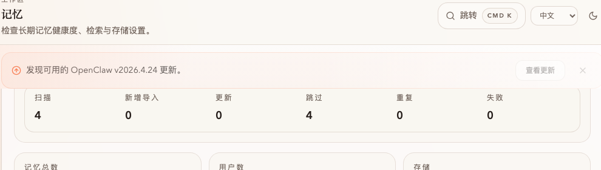
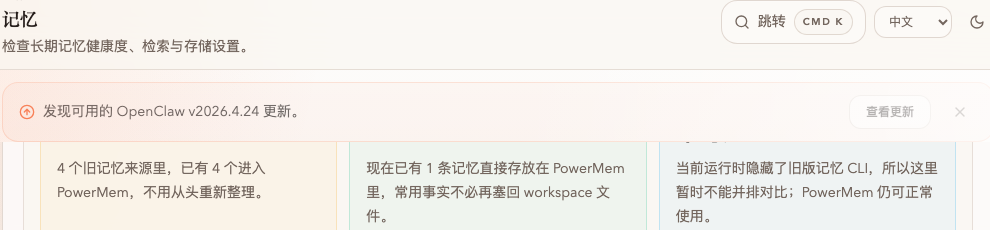
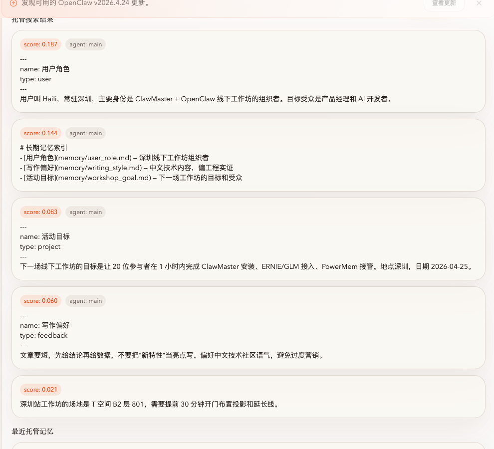
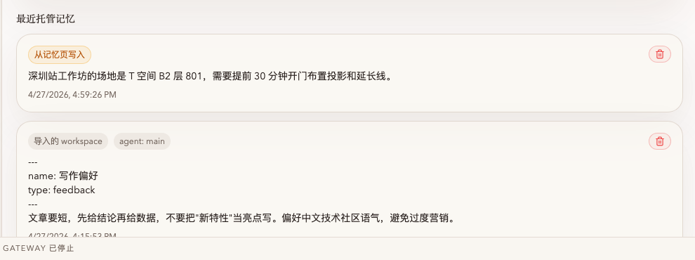
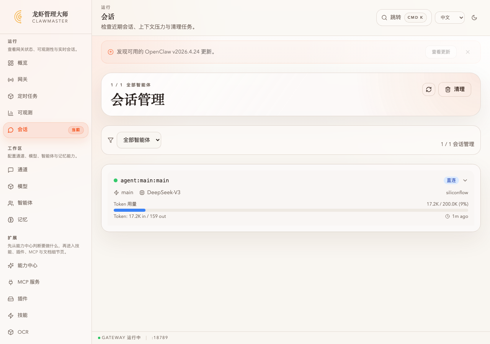

# タスク：PowerMem に OpenClaw のファイルベース記憶を引き継がせる

**能力**: Save（コア能力 #4）
**所要時間**: 約 10 分
**難易度**: 初級（[wizard-ernie-glm](../../setup/wizard-ernie-glm/) 完了後）

> OpenClaw ブリッジを同期 → `~/.openclaw/workspace/MEMORY.md + memory/*.md` をワンクリックでインポート → UI から新しい事実を 1 件書き込む → セマンティック検索を走らせる → 新しい `openclaw agent` セッションで全部を呼び戻す。一連の流れで PowerMem がファイル記憶より優れている理由を実地で示します。

> 🌐 このタスクは中文で初筆。詳細・スクリーンショット付きは **[README_CN.md](./README_CN.md)** を参照。English: [README.md](./README.md)

## TL;DR

1. 左ナビ → **記憶**。PowerMem 基盤パネル上部に 4 枚のサマリー＋ **OpenClaw ブリッジ** サブカード。**ブリッジ同期** を押すと、同梱の `memory-clawmaster-powermem` プラグインが OpenClaw にインストールされ、`plugins.slots.memory` がこれに切り替わり、`plugins.entries.memory-clawmaster-powermem` が現在 profile の `dataRoot` を指します。
   
2. **旧メモリ取り込み → OpenClaw メモリを取り込む**。`workspaceImport` が `~/.openclaw/workspace/MEMORY.md + memory/**/*.md` を走査し、`(agentId, path, content)` の SHA-256 指紋でファイルごとに 1 件の PowerMem レコードを挿入。冪等：再実行ですべて `スキップ`、編集があれば `更新`、削除すればマネージド側も連動削除。
   
3. **なぜ PowerMem が便利か** の 3 枚カードでカバレッジ・直接書き込み数・旧 CLI の状態を確認。
   
4. 大入力欄にワークスペースと関係ない新しい事実（例：「深圳会場は T Space B2 801、プロジェクタ+延長コード設置のため 30 分前入り」）を書いて保存。次に「下一场工作坊在哪里 / 次のワークショップはどこ？」で **検索**。ワークスペース由来と UI 直接書き込みが同じ結果リストにスコア付きで並びます。
   
5. **最近のマネージド記憶** は出自タグで経路を区別。
   
6. 新しいターミナルで `openclaw agent` を呼ぶと、`memory_recall` 経由で事実を呼び戻します：
   ```bash
   $ openclaw agent -m "我下一场工作坊地点在哪里？" --agent main --local
   [plugins] memory-clawmaster-powermem: auto-captured 1 memory chunk(s)

   根据你的长期记忆，下一场线下工作坊的地点是 **深圳 T 空间 B2 层 801**、
   日期是 **2026-04-25**。 需要提前 30 分钟到场布置投影和延长线。
   ```
   回答はワークスペース由来（`workshop_goal.md` の「深圳/2026-04-25」）と UI 直接書き込み（「T 空间 B2 801/30 分/投影」）を **混ぜ込んで** います。ClawMaster の **会话** ページにもこの `agent:main:main` セッションがトークン消費とともに記録されます。
   

> ⚠️ ブリッジが **非対応** → web 専用ランタイムです。desktop/Tauri ビルドでのみマネージドランタイムが有効化されます。

新しい OpenClaw ビルド（2026.4.15+）では `openclaw memory search` サブコマンドが削除されたため、旧 vs マネージドの並列比較パネルは設計上「使用不可」になります。grep 経路はもうメンテされず、マネージドセマンティック検索が唯一の前進経路です。

詳細な手順・CLI 検証・トラブルシュート（プラグイン安全検査の迂回、drift 解消、agent セッションのデバッグ）は [README_CN.md](./README_CN.md) を参照。
