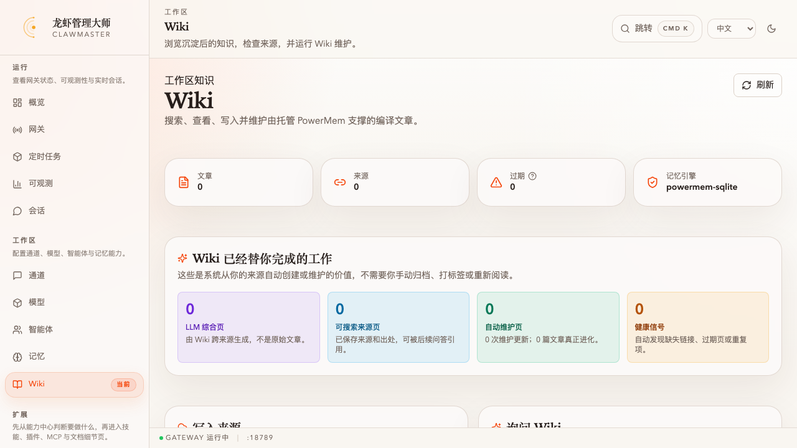
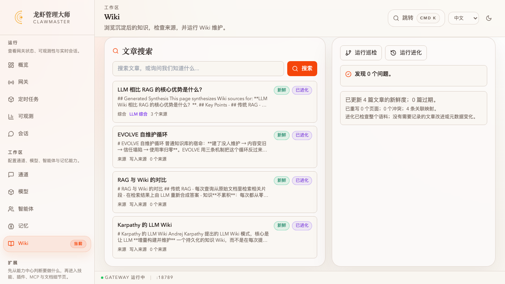
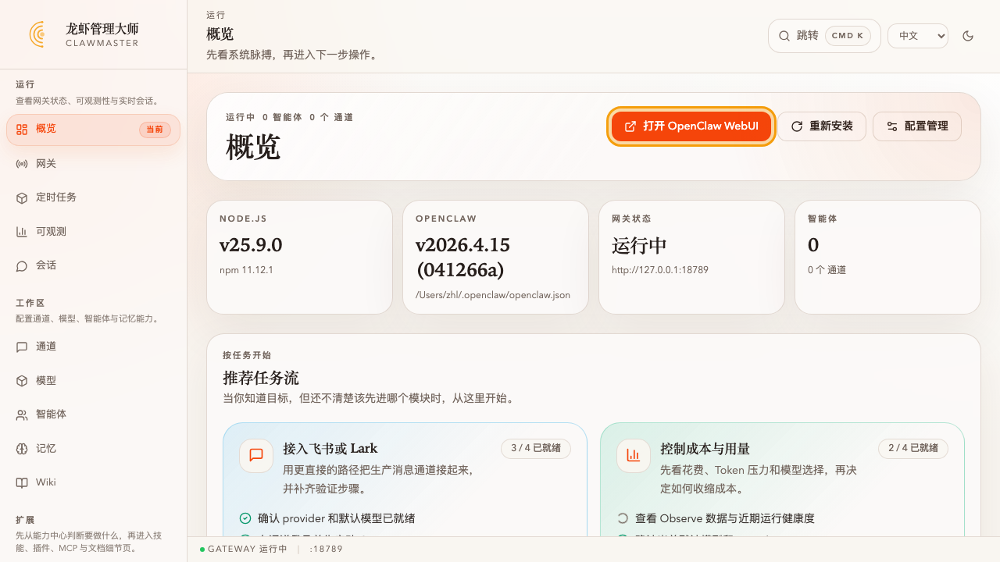
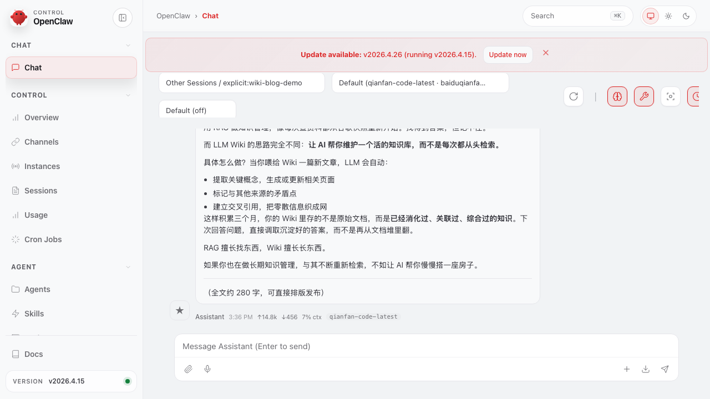
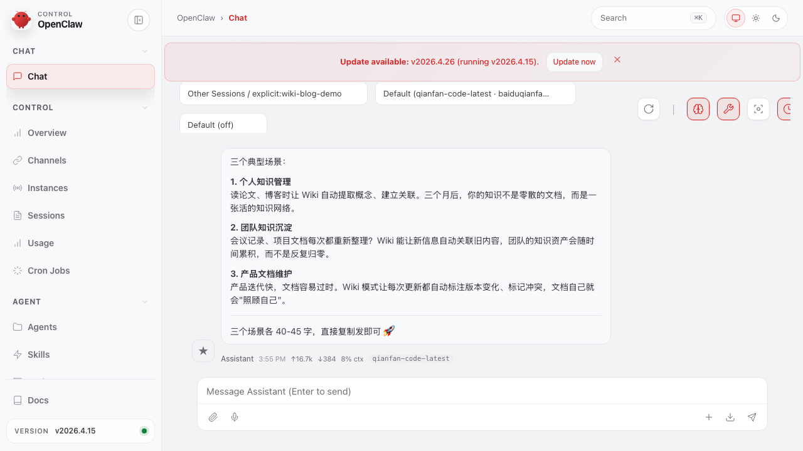
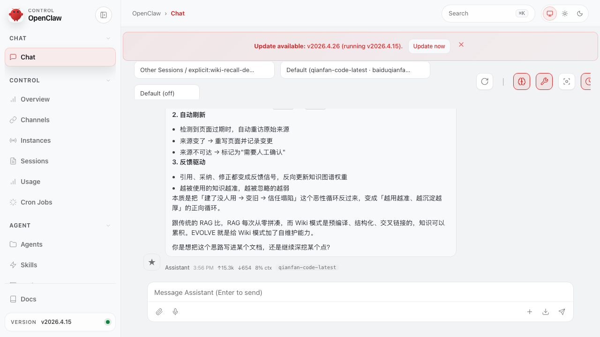

# 任务：把几篇来源编译成一个会自我维护的 Wiki

**能力域**：Save · **用时**：~10 min · **难度**：入门（建议先做 [wizard-ernie-glm](../../setup/wizard-ernie-glm/README_CN.md)）

> 在 ClawMaster 把 3 篇相关笔记写入 Wiki → 看 Wiki 自动打上新鲜度、生命周期、链接标签 → 基于已沉淀内容提问 → 把好答案一键保存成综合页 → 跑一次进化，让 Wiki 检查自己并记录健康信号。**然后跨到 OpenClaw WebUI**，像平时那样让 agent 「帮我写一篇公众号草稿」——你没提 wiki、没贴链接，但 agent 写出来的内容显然带着你沉淀过的观点。整个过程展示：**来源是用户投喂的，Wiki 是系统编译和维护的；在 ClawMaster 里沉淀一次，在 OpenClaw 日常聊天里自然被用到** —— 不需要手动归档、打标签或每次都重新贴素材给 agent。

> 🌐 English：[README.md](./README.md) · 日本語：[README_JP.md](./README_JP.md)

## 前置条件

1. ClawMaster web 模式正在本机跑（`clawmaster` 命令或 `npm run dev` 起的 openclaw-manager web，默认端口 16223）。桌面 Tauri 版暂不含 Wiki 模块
2. 已做过 [wizard-ernie-glm](../../setup/wizard-ernie-glm/README_CN.md) 或在设置里确认 PowerMem 引擎已启用（顶部状态卡「记忆引擎」显示 `powermem-sqlite` 或 `powermem-seekdb`）
3. 首次进 Wiki 页面是空白，没关系，本任务就是从 0 开始

## TL;DR

1. 左侧「工作区」导航进 **Wiki**，顶部四张卡：文章 / 来源 / 过期 / 记忆引擎
2. 「**写入来源**」里粘一段 Markdown（或外部链接），点「**写入**」—— 链接会弹确认；Markdown 直接进
3. 页面卡亮起 **新鲜 / 刚写入 / 写入来源** 三个信号标签
4. 「**询问 Wiki**」里提一个跨来源的问题，看 Wiki 把相关页列出来，然后点「**保存综合页**」把答案固化
5. 右下角点「**运行进化**」—— 看「Wiki 已经替你完成的工作」这个卡片块的数字往上跳
6. 从 ClawMaster **概览**页跳到 **OpenClaw WebUI**，像平时一样发一句「**帮我写一篇 300 字的公众号草稿，主题是 XX**」——agent 会自动把 Wiki 里相关的页面拉进上下文，写出来的稿子里带着你沉淀过的观点

## 主要关键帧


*任务做完的终态。顶部四张卡：4 篇文章 / 0 篇过期；中间「Wiki 已经替你完成的工作」：1 篇 LLM 综合页、3 篇来源、4 次自动维护、0 条健康信号。下方列表里能看到生成的综合页。*

---

## 第 1 步：进入 Wiki，看一眼空白状态


*刚打开的 Wiki 页面。统计卡全是 0，「Wiki 已经替你完成的工作」也全是 0。这是起点。*

左侧导航「工作区」那一组里点 **Wiki**，页面会落在 `/wiki`。

顶栏的四张统计卡从左到右分别是：

- **文章** —— Wiki 里所有页的总数（来源页 + 综合页）
- **来源** —— 统计有外部 URL 或文件路径的页，用来看「真正投进来的原材料」多少
- **过期** —— 进化检测判定新鲜度分数低于阈值的页数
- **记忆引擎** —— 当前 PowerMem 后端（`powermem-sqlite` 或 `powermem-seekdb`）

中间的「**Wiki 已经替你完成的工作**」四个彩色卡是这个任务的核心指标区。它不是展示你做了多少，而是**展示 Wiki 替你做了多少**：生成了几篇综合页、保留了几篇可搜索的来源、触发了几次自动维护、发现了几条健康信号。现在全是 0，等下会看到它变化。

## 第 2 步：投入第一批来源


*左侧「写入来源」卡。粘入一个外部 URL 后点「写入」，Wiki 会弹出一条黄色提示：「URL 写入必须显式确认」，附 4 个选项：**写入 URL** / **仅总结一次** / **仅本轮使用** / **取消**。*

Wiki 对 URL 写入会多问一步，原因是：

- **写入 URL** —— 同意抓取这个链接并作为一篇来源页长期保存（写入 Wiki）
- **仅总结一次** —— 这次会话拿来做摘要，但不写入 Wiki
- **仅本轮使用** —— 只在当前对话里暂存，不归档
- **取消** —— 完全丢弃

这条弹窗是明确的信任边界：默认情况下 Wiki 不会对你粘进来的 URL 做任何静默抓取或持久化。点一下「取消」收起这个弹窗。

接下来走 **Markdown 直接写入** 的路径（不需要确认）。把下面三段内容分别填入「写入来源」卡（每段操作一次：填「文章标题」+ 把 Markdown 粘到「要编译进 Wiki 的 Markdown 或笔记」→ 点写入）：

**第一条 —— 标题：`Karpathy 的 LLM Wiki`，正文：**

```markdown
# Karpathy 的 LLM Wiki

Andrej Karpathy 提出的 LLM Wiki 模式，核心是让 LLM **增量构建并维护** 一个持久化的知识 Wiki，而不是在每次提问时从原始文档里临时拼凑答案。

## 关键洞察

- Wiki 是**持久的、可累积的**构件：交叉引用已经就位、矛盾已经标注、综合已经完成。
- 每次引入新来源，LLM 会更新实体页、补充主题摘要、标记冲突，而不是仅做索引。
- 用户负责**挑选来源与提问**，LLM 负责**总结、交叉引用与归档**等机械劳动。
```

**第二条 —— 标题：`RAG 与 Wiki 的对比`，正文：**

```markdown
# RAG 与 Wiki 的对比

## 传统 RAG
- 每次查询从原始文档里检索相关片段
- 在检索结果上由 LLM 重新合成答案
- 知识**不累积**：每次都从零拼凑

## LLM Wiki 模式
- 来源被**预先编译**成结构化页面并交叉链接
- 回答直接调用已沉淀的 [[Karpathy 的 LLM Wiki]] 页面与综合页
- 系统越用越富：旧来源被新内容反向写入、矛盾被标注
```

**第三条 —— 标题：`EVOLVE 自维护循环`，正文：**

```markdown
# EVOLVE 自维护循环

普通知识库的宿命：**建了没人维护 → 内容变旧 → 信任塌陷 → 使用率归零**。EVOLVE 用三条机制把这个循环反过来。

## 三条机制
- **艾宾浩斯衰减**：每页有一个 `freshness_score`，每次被引用会重置衰减时钟。
- **自动刷新**：过期页会尝试重访原始来源；变了就重写并记录变更。
- **反馈驱动**：引用/采纳/修正被当成反馈信号，反向更新权重。

参考 [[Karpathy 的 LLM Wiki]] 与 [[RAG 与 Wiki 的对比]]。
```

> 💡 第二、第三条都用了 `[[页面标题]]` 双向链接语法。Wiki 的 Markdown 预览器会把这些渲染成可点击的跳转按钮。

## 第 3 步：看 Wiki 自动给页面打标签


*写完三条后的状态。「Wiki 已经替你完成的工作」：**3 篇可搜索来源页、3 次自动维护、3 篇真正进化**。底部列表里每一项都带着三个小标签：**新鲜**（绿）、**已进化**（紫）、**写入来源**（蓝）。*

每写完一页 Wiki 都会：

1. **打新鲜度标签** —— 新写入的页默认是 `新鲜`（绿色）。过一段时间没被访问会衰减成 `衰减中`（橙）甚至 `过期`（红）
2. **打生命周期标签** —— 刚写入的页是 `刚写入`，被进化检查过会变成 `已更新`/`已进化`
3. **打来源类型标签** —— 手动粘的是 `写入来源`（源自用户）；下一步查询之后生成的会是 `LLM 综合`（系统生成）
4. **交叉链接** —— 文章里的 `[[页面标题]]` 会被解析成反向链接

## 第 4 步：点开一篇，看详情卡


*点任意一页后弹出的详情模态。顶部两个横幅：左边紫/蓝/灰的**来源横幅**（标出是 LLM 综合、写入来源还是托管页面），右边绿/紫的**进化横幅**（显示进化时间与证据）。下方是渲染好的 Markdown，`[[双链]]` 可以点进去跳页。再下面是元数据网格：反向链接、链接、引用、证据来源等。*

详情卡的信息密度是 Wiki 的核心体验。它一次性告诉你：

- **这页从哪来**：写入来源 vs LLM 综合 vs 长期托管页面
- **最近一次进化做了什么**：只做了新鲜度检查，还是真的改了内容
- **谁引用了它 / 它引用了谁**：反向链接 + 链接
- **出处**：证据来源（URL 或原文件路径）

这里看 `EVOLVE 自维护循环` 那篇，能看到它显式引用了 `Karpathy 的 LLM Wiki` 和 `RAG 与 Wiki 的对比`—— 你写笔记时顺手敲的双链，Wiki 帮你全记下来了。

## 第 5 步：问一个跨来源问题，把好答案保存下来


*右侧「询问 Wiki」卡。提问后 Wiki 列出 3 个相关来源与摘要，底部出现一句提示：「确认后可将这个回答保存为持久 Wiki 知识」，旁边有「保存综合页」按钮。*

在「询问 Wiki」里填：

```
LLM Wiki 相比 RAG 的核心优势是什么？
```

点「**提问**」。Wiki 会从沉淀的 3 篇页里挑相关的给出答案（当前构建版本走的是启发式检索 + 已沉淀 Markdown 的片段合成；如果你配好了可用的默认模型，后续版本会直接让 LLM 做综合）。

点「**保存综合页**」之后，Wiki 会：

1. 新建一篇 `synthesis/` 类型的页（标签是紫色的 **LLM 综合**）
2. 把这次问答的答案写进页正文，标注引用的来源页
3. 自动跳转到这篇新页的详情卡，让你看 Wiki 给它填了什么元数据

这一步就是 Karpathy 说的 **「LLM 做机械劳动」**：把一次好问答沉淀成一篇可被未来问答复用的综合页，不需要你自己打开编辑器。

## 第 6 步：让 Wiki 自检一次


*底部两个按钮：**运行巡检** 和 **运行进化**。巡检结果会列出「缺失链接、过期页、重复标题」等问题；进化结果会报告「已更新 X 篇文章的新鲜度；X 篇过期；已重写 X 个页面；X 个冲突；X 条关联映射」。*

- **运行巡检（Lint）**：扫描所有页，找缺失链接、过期页、重复标题、孤岛页、schema 违规等。发现问题会在「Wiki 已经替你完成的工作」那排的**健康信号**卡里累计
- **运行进化（Evolve）**：重新计算每页的新鲜度分数、检查来源是否仍可达、必要时重写内容并记录证据

进化跑完后回到顶部，会看到「Wiki 已经替你完成的工作」里的数字全部向上跳：

- **LLM 综合页** +1（刚才保存的综合页）
- **自动维护页** 从 3 涨到 4（把综合页也纳入了）
- 如果 Wiki 发现页之间没相互链接 / 重复主题，**健康信号** 会 > 0

## 第 7 步：在 OpenClaw WebUI 里让 agent 基于 Wiki 干活

前面六步展示的是**在 ClawMaster 里维护 Wiki**。最后一步跨一次前端：在 OpenClaw WebUI（agent 聊天界面）里像平时一样让 agent 帮你干活——**不用说"用 wiki 里的内容"，也不用贴页面链接**——Wiki 会在背后自动把相关页面端上桌。这是 Wiki 作为「共享知识层」的真正价值：**在 ClawMaster 里沉淀一次，在日常聊天里自然被用到**。

### 7.1 从 ClawMaster 跳进 OpenClaw WebUI


*ClawMaster 左侧导航 **概览** 页的顶栏：网关状态旁边就是 **打开 OpenClaw WebUI** 按钮（橙框高亮处）。点一下会在新标签页打开 `http://127.0.0.1:18789/?token=...`，直接带着网关 token 进到 agent 聊天界面。*

也可以不走 UI，直接访问 `http://127.0.0.1:18789/?token=<gateway token>`——token 就是 `~/.openclaw/openclaw.json` 里的 `gateway.auth.token`。进到 WebUI 以后，在左侧会话列表新建一个会话（URL 里加 `?session=wiki-blog-demo` 即可）。

### 7.2 让 agent 写一篇公众号——不提 wiki

一个最贴近日常使用的场景：你读了几篇相关文章，想把观点整理成一篇公众号短文。发一个**自然的写作请求**（不提 wiki，不提"知识库"）：

```
帮我写一篇 300 字左右的微信公众号短文草稿，主题：为什么 LLM Wiki 比传统 RAG 更适合长期知识积累。要能直接发出去的语气，适当用短段落。
```

回车发送。


*Agent 生成的公众号草稿。正文里出现的"提取关键概念"、"标记与其他来源的矛盾点"、"建立交叉引用"直接来自你第 2 步写进 Wiki 的 `Karpathy 的 LLM Wiki` 页；"RAG 擅长找东西，Wiki 擅长长东西"这句标语是基于 `RAG 与 Wiki 的对比` 页再综合出来的。注意：**你没提 wiki**，agent 自己去找了。*

你没有在提示里提到"wiki"或"知识库"，也没有贴任何页面链接。但 agent 显然在用你沉淀的内容——**这就是自动召回**：

1. PowerMem 插件的 `before_agent_start` 钩子读取这条消息
2. 检测到话题关键词（LLM Wiki / RAG / 知识积累），把 Wiki 里匹配的页面打包成 `<relevant-wiki>` 段注入到 agent 的系统上下文
3. 系统指令告诉 agent：碰到 wiki 话题优先看 `<relevant-wiki>`
4. Agent 直接基于这些页面写稿，得到的是**你自己沉淀过的观点**的再表达，而不是互联网上随机一篇文章的味道

### 7.3 顺着同一个会话再要一段——继续拿 Wiki 当素材

写完公众号通常还会附一段"场景列表"。同一个会话里继续追问：

```
在这个思路基础上，给我列三个最适合用 LLM Wiki 的典型场景，每个 50 字以内，可以顺手发到读者群里。
```


*三个场景的清单：个人知识管理 / 团队知识沉淀 / 产品文档维护。每条都紧扣前面公众号里立下的观点——**个人 / 团队 / 产品** 三条线里有两条直接映射到 `EVOLVE 自维护循环` 页里讨论的"建了没人维护"场景。Agent 在**同一个话题线**里持续调用 Wiki 素材，不需要你每条都重复背景。*

这是普通聊天里最常见的「一问一答接续」。你也可以把它当成"**agent 连续思考帮我整理内容**"——素材一直来自你的 Wiki。

### 7.4 换一个会话，问一句回忆式问题

另一个超级常见的场景是"**我们之前讨论过这个吗？**"。在全新会话里发：

```
我们之前讨论过 EVOLVE 是怎么解决知识库没人维护这个问题的吗？如果讨论过，告诉我具体思路。
```


*Agent 的回答：开头第一句是"**是的，刚才的 relevant-memories 里已经提到了这个思路**"——它显式承认这是被注入进来的 Wiki 内容。然后逐条复述艾宾浩斯衰减、自动刷新、反馈驱动这三条机制，跟你第 2 步写进 `EVOLVE 自维护循环` 页的内容**逐字对齐**。最后还顺手接上 RAG vs Wiki 的对比，完成跨来源综合。*

关键一点：这是**全新会话**。没有任何上文，也没有提「wiki」「知识库」这类词——只有"我们之前讨论过吗"这个自然的回忆式口吻，自动召回就触发了，因为你提问里包含了 Wiki 沉淀过的主题词（EVOLVE、知识库、维护）。

### 其它自然场景

同样的自动召回机制在日常还能怎么用：

- 「**帮我写一段 twitter 短贴**，推广 LLM Wiki 这个概念」 — agent 拿 Wiki 里的综合页 + 对比页作为素材
- 「**之前存过这个话题吗？**」「**这个观点我们聊过吗？**」 — 自然的回忆式问题触发召回，agent 会报页面列表
- 「**基于我们积累的资料**，给我列三个使用 LLM Wiki 的典型场景」 — wiki 关键词触发召回（上面 7.3 演示）
- 「**我刚读到某篇文章**，帮我对比一下和我们已经有的观点的异同」 — Wiki 出来的是你自己已经综合过的观点，对比起来有明确的立场

### 关于"帮我把这篇文章存下来"类请求

你在 WebUI 里发一条裸 URL + "帮我存下来"，agent 会在对话层面响应（读一读、给个摘要），但它**不会**真的写入 Wiki——因为目前没有 `wiki_ingest` 这个 agent 工具。真正要把一条 URL 固化进 Wiki，有两条确定路径：① 回到 ClawMaster 的「写入来源」卡按第 2 步的流程点「写入 URL」；② 通过已配置的**外部渠道**（Telegram / Discord 等）发给 agent，渠道投递路径会触发三选项提示（写入 Wiki / 仅摘要一次 / 仅本轮使用）。

---

## 对照：这个任务展示了什么

| 操作 | 你做的事 | Wiki 自动做的事 |
|---|---|---|
| 写入 3 条 Markdown | 提供原材料 | 切成页 → 打新鲜度/生命周期/类型标签 → 解析 `[[双链]]` → 写入 PowerMem |
| 提一个跨来源问题 | 问问题 | 检索相关页 → 合成答案 → 标引用 |
| 点「保存综合页」 | 同意沉淀 | 新建 `synthesis/` 页 → 填元数据 → 反向链接回原来源 |
| 点「运行进化」 | 触发维护 | 重算新鲜度 → 检查来源可达性 → 记录进化证据 |
| 在 OpenClaw WebUI 里说「帮我写篇公众号」 | 自然聊天，不提 wiki | 自动注入 `<relevant-wiki>` 上下文 → agent 基于沉淀内容写稿 → 不用手动贴素材 |

**你的手动工作量**：写 3 篇笔记 + 问 1 个问题 + 点 2 下按钮 + 在 WebUI 里写一句自然请求。
**Wiki 替你做的工作**：分类、打标签、交叉引用、保存综合页、周期性维护、健康自检、**在 agent 日常回答时自动端上已沉淀的观点**。

---

## 常见问题

**Q：左侧导航里没看到 Wiki 入口。**
→ Wiki 模块目前只在 **web 模式** 出现（`clawmaster` 命令或 `npm run dev` 起的 web 服务）。桌面 Tauri 版还没上这个模块，后续版本会补。

**Q：顶部「来源」卡一直是 0，但我明明写入了 3 篇。**
→ 「来源」卡统计的是有**外部 URL 或文件路径**的页。手动粘 Markdown 内容没有外部出处，不计入这个数。本任务演示的就是纯手动写入场景；想看它动起来，写入一条 URL 并点「写入 URL」。

**Q：点「写入」没反应，也没弹确认。**
→ 确认右边的「来源 URL 或文件路径」字段是不是填了 URL 但没填正文，或反过来。最简单的组合是：**只填标题 + 正文**（纯 Markdown），不填来源字段，这样会以 `manual` 类型直接入库。

**Q：询问 Wiki 后答案看起来像是把来源片段拼起来。**
→ 当前构建版本的 query 走的是启发式检索 + 片段拼接。后续版本会在默认模型配好时让 LLM 做真正的综合。不管是哪种模式，「保存综合页」都可以把这次结果固化成一页。

**Q：「运行进化」之后没有任何变化。**
→ 新写入的页本身就是新鲜的，进化不会改它们。可以等一段时间后再跑（新鲜度分数会按艾宾浩斯曲线衰减），或直接看「Wiki 已经替你完成的工作」那一排：`自动维护页`的计数就是进化检查过的页数。

**Q：Markdown 里的 `[[双链]]` 点下去跳错页。**
→ 双链的解析是按**页标题**匹配的。确认你要链到的那页的标题跟 `[[...]]` 里的文字完全一致（中英文、空格、标点都要对上）。

**Q：Wiki 文件实际存在哪？**
→ 正文 Markdown 在 `~/.openclaw/wiki/pages/`，元数据（新鲜度、冲突）在 `~/.openclaw/wiki/.meta/`。可以用 Obsidian 直接打开这个目录，Wiki 也会把手动编辑同步回 PowerMem。

**Q：在 WebUI 写出来的内容看不出用了 Wiki，感觉是 agent 自己编的。**
→ 两个常见原因：① 请求的主题词跟 Wiki 里沉淀的页面词汇离得远，召回的相关性分数没过阈值。试着把关键词跟 Wiki 里出现过的名词对齐（比如把"知识管理"换成"LLM Wiki"、"RAG"、"持久化知识库"之类你 Wiki 里真出现过的词）。② 模型本身不太会引用上下文——换个更擅长守系统指令的模型（顶部下拉里选 DeepSeek V3 或 qianfan-code-latest 试试），再让它「基于已沉淀的资料」写一遍，引用感会明显。

**Q：我在 WebUI 里发 URL + "帮我存下来"，agent 说存好了但 Wiki 页面列表里没看到。**
→ 目前 **agent 手里没有 `wiki_ingest` 工具**，"存到 Wiki" 对它来说只是对话层面的响应，不会真的写文件。要真正固化一条 URL，用两条确定路径：① 回到 ClawMaster Wiki 的「写入来源」卡填 URL + 点「写入 URL」；② 在外部渠道（Telegram / Discord 等）里发 URL，渠道投递会触发三选项提示。

**Q：在 WebUI 发 URL 没看到三选项提示。**
→ 这个提示走的是**渠道消息**（Telegram / Discord / Slack 等）投递时的 `before_dispatch` 钩子，不是 WebUI 聊天直连的路径。要在 ClawMaster 里用三选项的话，用「写入来源」卡填 URL；要在外部渠道里用，配置一个渠道账号再在那边发 URL。

---

## 下一步

- Save：还没把 PowerMem 接上的话先做 [powermem-takeover-file-memory](../powermem-takeover-file-memory/README_CN.md)
- Save：想看 PowerMem 当时序存储用的样子，可以做 [cron-package-downloads-tracker](../cron-package-downloads-tracker/README_CN.md)
- Observe：[cron-cost-digest](../../observe/cron-cost-digest/README_CN.md) 把进化维护自身做成 cron（等下个版本暴露到模板）
