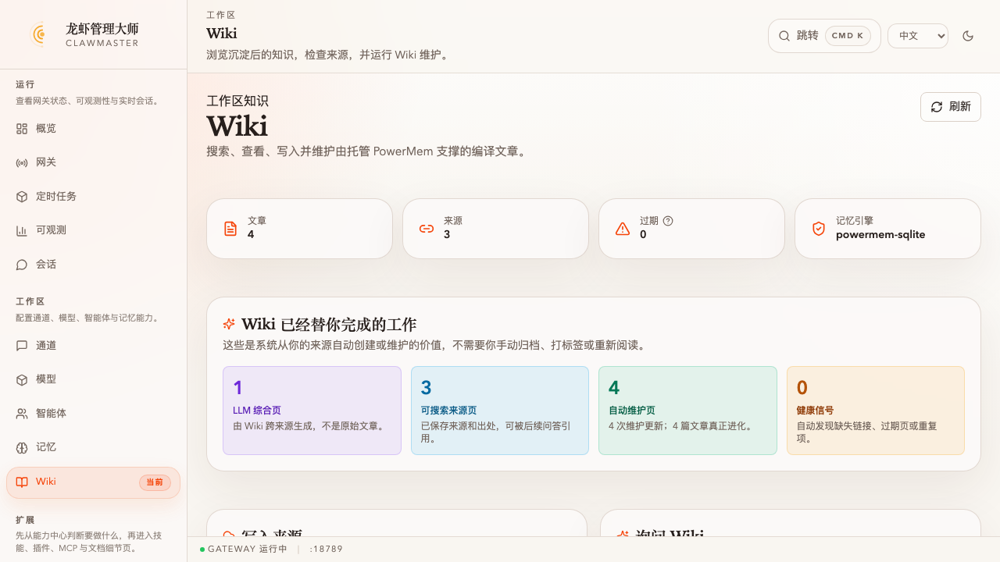
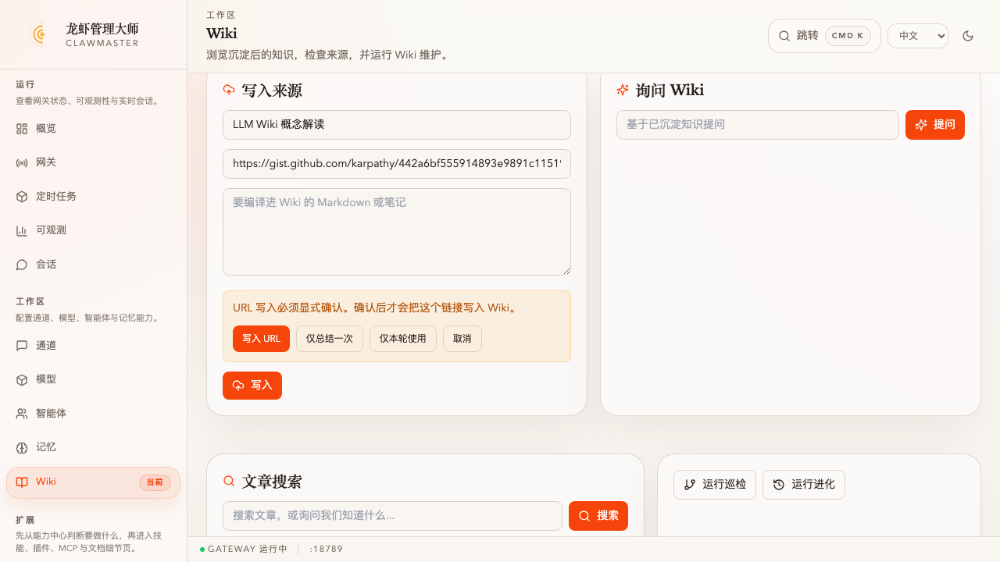
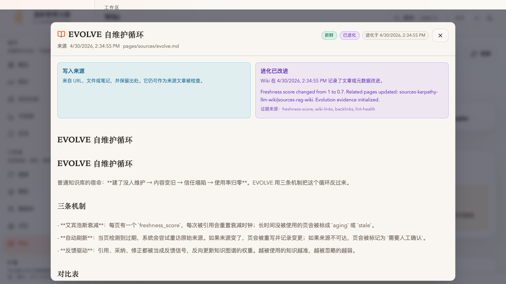
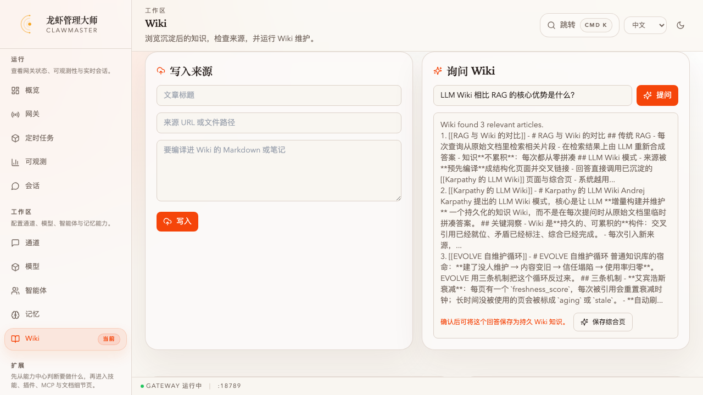
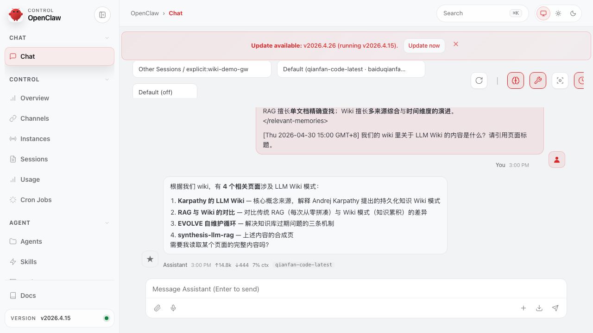

# タスク：数本のソースを自己保守する Wiki にコンパイル

**能力領域**：Save（コア能力 #3）
**所要時間**：~10 分
**難易度**：入門（[wizard-ernie-glm](../../setup/wizard-ernie-glm/) の後）

> ClawMaster で関連する 3 本のノートを Wiki に投入 → Wiki が鮮度・ライフサイクル・リンクのタグを自動付与 → 複数ソースを跨ぐ質問を投げる → 良い回答をワンクリックでシンセシスページとして固化 → Evolve を走らせて Wiki 自身を点検させる。**次に OpenClaw WebUI に切り替え**、エージェントに Wiki 関連の質問をすると、取り込んだばかりのページをタイトルで引用するのが確認できる。要点：**ソースはあなたが投入し、Wiki がコンパイルと保守を担当する；ClawMaster は編集の場、OpenClaw WebUI はエージェントが使う場** —— 手作業の分類・タグ付け・再読は不要。

> 🌐 本タスクは **中文優先** で執筆されました。完全版は **[README_CN.md](./README_CN.md)**。English stub：[README.md](./README.md)

## 主要フレーム

*終点状態：上部は 4 篇/0 篇過期。中段の「Wiki が代わりにやった仕事」カード：LLM シンセシス 1 / ソースページ 3 / 自動保守 4 / ヘルスシグナル 0。リストには生成されたシンセシスページが並ぶ。*

*URL 取り込みゲート —— Wiki は外部 URL を黙って永続化しない。明示的な 4 択：URL を書き込む / 一度だけ要約 / 今回の会話のみ / キャンセル。*

*ページ詳細モーダル：由来バナー（ソース/LLM シンセシス/保守中）＋進化バナー（変更済み vs チェック済み）＋ `[[双リンク]]` がクリック可能な Markdown プレビュー＋メタデータグリッド。*

*Wiki に質問：取り込んだページから合成された回答に「シンセシスページとして保存」オファーが付き、一度きりの Q&A を再利用可能なページに変える。*

*OpenClaw WebUI —— エージェントが Wiki 関連の質問に答える際、Wiki に書き込んだ各ページ（`Karpathy 的 LLM Wiki` / `RAG 与 Wiki 的对比` / `EVOLVE 自维护循环` と第 5 ステップで保存した `synthesis-llm-rag`）をタイトルで引用する。注入は PowerMem プラグインの `before_agent_start` フックが自動で行う。*

## TL;DR

1. Workspace ナビ配下の **Wiki**（`/wiki`、web モード限定 — デスクトップ Tauri にはまだ実装なし）を開く
2. 「**ソース書き込み**」に関連する Markdown ノートを 3 本貼って「**書き込み**」。純 Markdown は直接、URL は 4 択の確認ゲート経由
3. 各ページに **新鮮 / 書き込み済み / ソース** のタグが自動で付き、`[[双リンク]]` は逆方向リンクとして解析される
4. 「**Wiki に質問**」で複数ソースを跨ぐ問いを投げ、「**シンセシスを保存**」で新しい LLM シンセシスページとして固化
5. 「**進化を実行**」 —— 「Wiki が代わりにやった仕事」の各カウンタが上がる：LLM シンセシスページ、自動保守ページ、ヘルスシグナル
6. ClawMaster **概要** から **OpenClaw WebUI** に移動、Wiki 関連のキーワード（「wiki」「知識ベース」「我々が知っていること」など）を含む質問を投げて、エージェントが取り込んだページをタイトルで引用するのを確認

## このタスクが示すもの

| ユーザーの作業 | Wiki が自動でやる作業 |
|---|---|
| Markdown ノート 3 本を書く | ページに分解 → 鮮度/ライフサイクル/タイプをタグ → `[[双リンク]]` を解決 → PowerMem にインデックス |
| 1 つの跨ソース質問 | 関連ページを取得 → 回答を合成 → ソースを引用 |
| 「シンセシスを保存」クリック | `synthesis/` ページを新規作成 → メタデータを埋める → ソースへ逆リンク |
| 「進化を実行」クリック | 鮮度を再計算 → ソースの到達性を確認 → 進化エビデンスを記録 |
| OpenClaw WebUI で質問 | 通常のチャット送信 | `<relevant-wiki>` コンテキストを自動注入 → エージェントがページをタイトルで引用 → 手作業の貼り付け不要 |

手作業の総量：ノート 3 本 + 質問 1 つ + クリック 2 回 + WebUI チャット 1 回。分類・タグ付け・クロスリファレンス・シンセシス・定期保守・ヘルスチェック・回答時にキュレート済みコンテンツをエージェントに渡すこと、すべて Wiki の仕事。

完全な手順、貼り付け用サンプルノート、FAQ（デスクトップ版でナビエントリが出ない／手動ノートで「ソース」カウンタが 0 のまま／`[[link]]` 解決ルール／vault ファイルの保存場所）は [README_CN.md](./README_CN.md) を参照してください。
