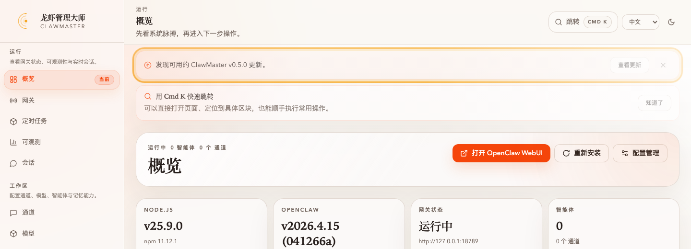
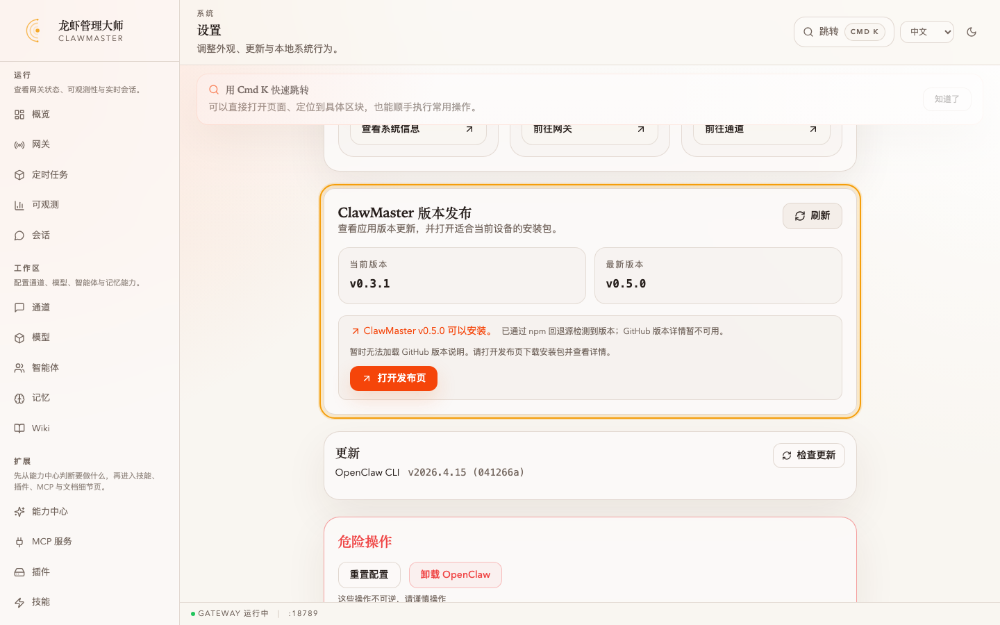
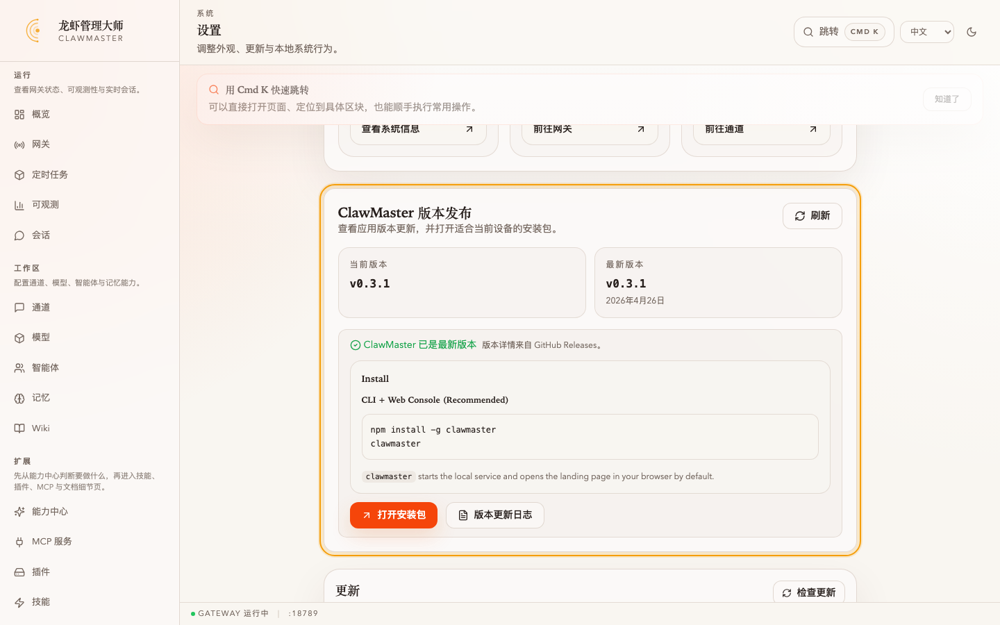

# 任务：通过「ClawMaster 版本发布」发现并升级新版本

**能力域**：Setup · **用时**：~5 min · **难度**：入门

> ClawMaster 从 v0.4.0 开始会主动检测自身新版本：顶栏橙色横幅 → 设置页「ClawMaster 版本发布」section 渲染 release notes + 自动匹配当前系统的安装包 → 一键跳转 GitHub 下载。GitHub Releases 是主源，npm metadata 是回退源（尊重 Settings 的 npm 镜像设置）。

> 🌐 本任务以 **中文优先** 编写。英文/日本語为 TL;DR 存根，完整走查见本页。English / 日本語 stubs：[README.md](./README.md) · [README_JP.md](./README_JP.md)

## 前置条件

1. 已完成 [wizard-ernie-glm](../wizard-ernie-glm/README_CN.md)（或任意方式使 ClawMaster 跑在本地）
2. 本机安装的 ClawMaster 版本 **低于** GitHub 上的最新 release（否则只能看到「已是最新版本」状态，没有升级流）
3. 能访问 <https://github.com/openmaster-ai/clawmaster/releases>；若走不通，需要配置 npm 镜像（见第 5 步）

## TL;DR

1. 顶栏看到「**发现可用的 ClawMaster v{version} 更新**」橙色横幅 → 点 **查看更新**
2. 跳转到「设置 → ClawMaster 版本发布」，section 渲染 release 的 Markdown 正文（标题 / 列表 / fenced code），而不是原始 `#` / \`\`\` 字符
3. 底部 **打开安装包** 按钮会根据 `navigator.platform` 自动选好当前系统的资产（macOS → `.dmg`，Windows → `.msi`，Linux → `.AppImage`），点一下直链到 GitHub 的下载 URL；旁边 **版本更新日志** 按钮跳 release 页
4. 关掉横幅后，**同一版本** 不会再弹；只有 GitHub 再发新 release 才会重新出现

---

## 第 1 步：横幅如何出现


*仪表盘顶部的橙色横幅：左边 ↗ 图标 + "发现可用的 ClawMaster v{version} 更新。"，右边「查看更新」按钮和关闭 ×。*

启动 ClawMaster 后，`Layout` 组件的 `useEffect` 里会调用 `checkClawmasterReleaseResult()` 做对比：

- **当前版本**：Vite 在 build 时通过 `vite.config.ts` 的 define 把 `package.json#version` 注入为 `__CLAWMASTER_VERSION__`，在 `src/lib/appVersion.ts` 中读取为 `CLAWMASTER_VERSION`
- **最新版本**：先查 `GET https://api.github.com/repos/openmaster-ai/clawmaster/releases?per_page=10`，取第一个非 draft/prerelease 的 release；`fetch` 挂一个 3 s 的 `AbortController`。超时或异常就回退到 **后端 `/api/npm/clawmaster-versions`**（桌面端走 Tauri `list_clawmaster_npm_versions` command），解析出 `distTags.latest`

对比走 semver（`compareReleaseVersions`）。只要 latest > current 且用户没在这个 latest 上点过关闭，Layout 就渲染橙色横幅。关闭按钮把 `clawmaster-release-dismissed:{version}` 写到 localStorage，发布新 release 时 key 变动，横幅会重新露出。

## 第 2 步：跳转到 Settings Release Section


*设置页「ClawMaster 版本发布」section（`id="settings-clawmaster-releases"`）：当前版本 / 最新版本 两个版本卡，橙色「↗ ClawMaster v0.5.0 可以安装」提示 + "版本详情来自 GitHub Releases" 来源标注；下方是渲染后的 release notes（What 标题、无序列表、fenced code block）。*

点「查看更新」→ Layout 跳到 `/settings#settings-clawmaster-releases`。section 里的 `ClawmasterReleaseSection` 组件会独立再跑一次 `handleCheck()`（不复用 Layout 的结果，保证打开设置页时数据是最新的）。

顶部两张卡片：

| 字段 | 来源 |
|---|---|
| **当前版本** | `CLAWMASTER_VERSION`（构建时注入） |
| **最新版本** | GitHub release `tag_name` 去掉 `v` 前缀；或 npm `distTags.latest` |

根据 adapter 拿到的 `source` 字段，section 会显示一条来源说明：

- `github`：**版本详情来自 GitHub Releases。**
- `npm`：**已通过 npm 回退源检测到版本；GitHub 版本详情暂不可用。**

## 第 3 步：阅读 Release Notes

GitHub 来源时，section 会把 release 的 Markdown body 过 `renderReleaseMarkdown` 渲染成 HTML（支持 `#` 标题、无序/有序列表、`**bold**`、fenced code block；走 sanitizer，禁止 `<script>` 和外链图片）。body 只取前 700 字符做预览，超出部分后面追一个 `...`。

npm 回退时，由于 npm metadata 不含 changelog，section 只渲染：

> 暂时无法加载 GitHub 版本说明。请打开发布页下载安装包并查看详情。

## 第 4 步：一键打开安装包

section 底部的 **打开安装包** 按钮（primary 样式）链接的 URL 由 `selectInstallerAsset(latestRelease, navigator.platform)` 决定 —— 不是下拉菜单，而是 **根据本机 `navigator.platform` 自动挑一个资产**：

| `navigator.platform` 子串 | 优先匹配的 `assets[]` 扩展名 |
|---|---|
| 含 `Mac` 或 `Darwin` | `.dmg`（找不到就 `.zip`） |
| 含 `Win` | `.msi`（找不到就 `.exe`） |
| 含 `Linux` | `.appimage` → `.deb` → `.rpm` |

点击走 `window.open(asset.browser_download_url, '_blank', 'noopener,noreferrer')`（Tauri 桌面端由 shell `open` plugin 接管）。如果当前 release 的 `assets[]` 里一个匹配都没有，按钮的文案会切成 **打开发布页**，链接指向 release 的 `html_url`。

右边的 **版本更新日志** 按钮只在 GitHub 来源且装包存在时出现，跳到 `latestRelease.htmlUrl`。

## 第 5 步：搭配 npm 镜像（国内网络）


*同一区块在 GitHub 不可达时的样子：版本号仍能检测到（来自 npm `distTags.latest`），但来源标注变成「已通过 npm 回退源检测到版本；GitHub 版本详情暂不可用」，下方只显示一段兜底说明、没有渲染 release notes。*

GitHub API 被墙时，adapter 会在 3 s 超时后自动 fallback 到 `/api/npm/clawmaster-versions`。后端 `npmService` 会 `npm view clawmaster versions --json` 去取元数据；Settings 里「能力 → npm 代理」开关决定实际走的 registry（见 [`wizard-ernie-glm`](../wizard-ernie-glm/README_CN.md) 里的 npm 镜像段落），即：

- 走默认 registry：`https://registry.npmjs.org`
- 勾上 npm 镜像开关：`https://registry.npmmirror.com` 或你填的自定义 registry

如果 `/api/npm/clawmaster-versions` 返回 5xx（比如网关被 kill），前端 section 显示：**无法连接 ClawMaster 后端……** 提示（`settings.updateBackendUnavailable`）。

---

## 对照：已是最新版本


*都是 v0.3.1（当前 = 最新）的情况下：两个版本卡号一致，中间出现绿色 ✓「ClawMaster 已是最新版本」，右边仍然保留 "版本详情来自 GitHub Releases" 的来源标注。*

仪表盘上横幅不会出现，section 里装包按钮仍然在（方便用户给另一台机器下载），但醒目提示换成绿色 checkmark。

---

## 验证

```bash
# 1) 版本注入是否生效（浏览器 DevTools Console）
#    把 appVersion.ts 的导出读出来：
window.__CLAWMASTER_VERSION__  # define 注入的常量
# 或者去 Settings 页直接看「当前版本」卡

# 2) GitHub adapter（curl 同一 URL）
curl -s "https://api.github.com/repos/openmaster-ai/clawmaster/releases?per_page=10" \
  | jq '.[0] | {tag_name, assets: [.assets[].name]}'

# 3) npm 回退（按 registry 切换）
npm view clawmaster version --registry=https://registry.npmmirror.com
# 或让后端代查：
curl -s http://127.0.0.1:16224/api/npm/clawmaster-versions | jq '.distTags.latest'

# 4) dismissal 持久化
# DevTools > Application > Local Storage > http://127.0.0.1:16224
#   key: clawmaster-release-dismissed:0.5.0
#   value: "1"
```

## 常见问题

**Q：装完新版本后，横幅还一直显示升级到上一个版本。** → Vite 构建时把版本写死，开发模式（`npm run dev:web`）读的是仓库里 `packages/web/package.json`；如果你只重装了全局 `clawmaster@latest` 但 dev 服务器还指着老代码，会看到旧版本号。切到 `npm run build && npm run preview` 或直接重启 `clawmaster` 命令走安装好的包。

**Q：release notes 显示成一大坨原始 Markdown。** → section 在 `source === 'github'` 时才过 markdown 渲染；检查来源标注那行是不是已经回落到 npm（`已通过 npm 回退源检测到版本`）。如果是，说明 GitHub 请求失败了，release body 不会被拉下来。

**Q：点「打开安装包」没反应（桌面端）。** → Tauri 的 shell `open` plugin 需要在 `src-tauri/tauri.conf.json` 的 `plugins.shell.open` allowlist 里允许 `github.com` 域名。浏览器端受 popup blocker 影响，确认允许 `127.0.0.1:16224` 弹窗。

**Q：`navigator.platform` 在我的机器上返回空字符串，装包按钮直接降级成「打开发布页」。** → 某些浏览器（Firefox 高隐私、部分定制环境）会返回空串。临时解决：直接点 **版本更新日志** 或 **打开发布页**，去 release 页手动挑。

**Q：镜像模式下仍然卡很久。** → npm CLI 某些版本会忽略 `--registry` 参数并走 `.npmrc` 全局配置。用 `npm config get registry` 确认当前生效 registry；如不一致，临时 `npm config set registry=https://registry.npmmirror.com` 再重试。

**Q：想重置 dismissal 手动再看一次横幅。** → DevTools 清掉所有 `clawmaster-release-dismissed:*` key，刷新即可。

---

## 下一步

- Observe：完成升级后看 [cron-cost-digest](../../observe/cron-cost-digest/README_CN.md) 验证新版监控链路
- Setup：若你还没走过 Setup 向导，先做 [wizard-ernie-glm](../wizard-ernie-glm/README_CN.md)
- Guard：把 `SkillGuard` 打开，确保升级后装的新 skill 走审查
