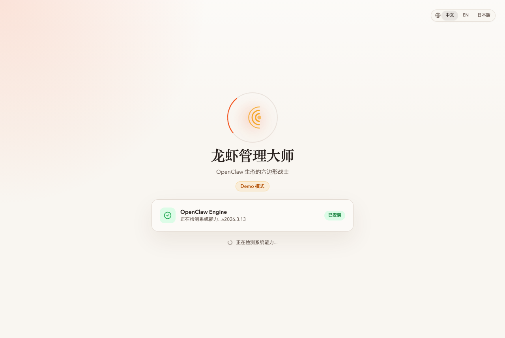
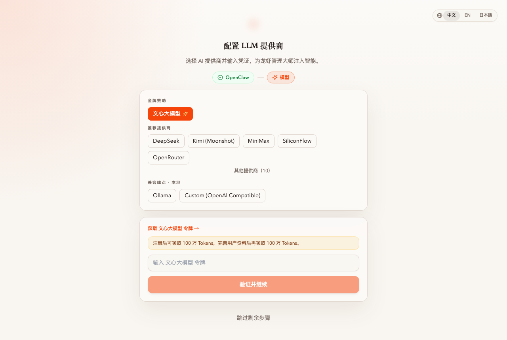
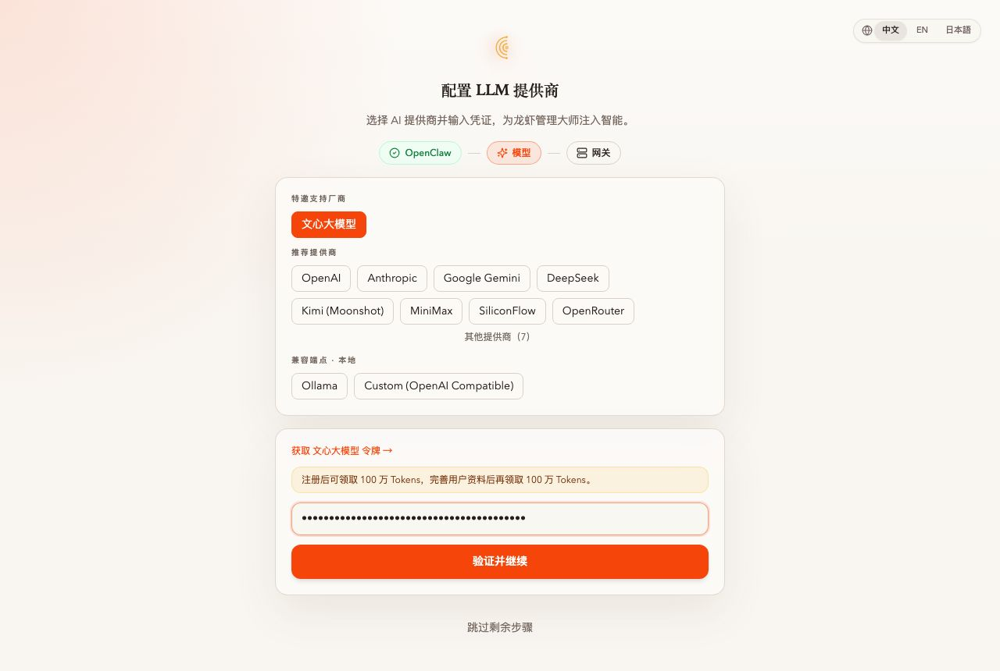
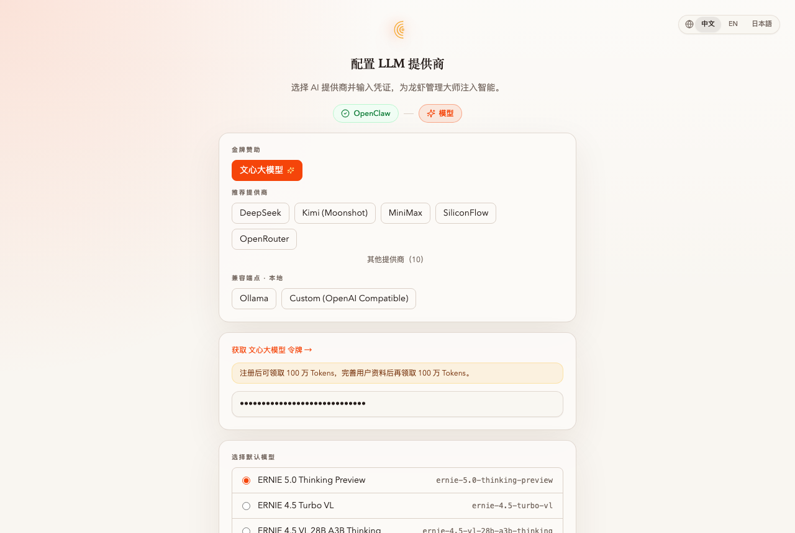
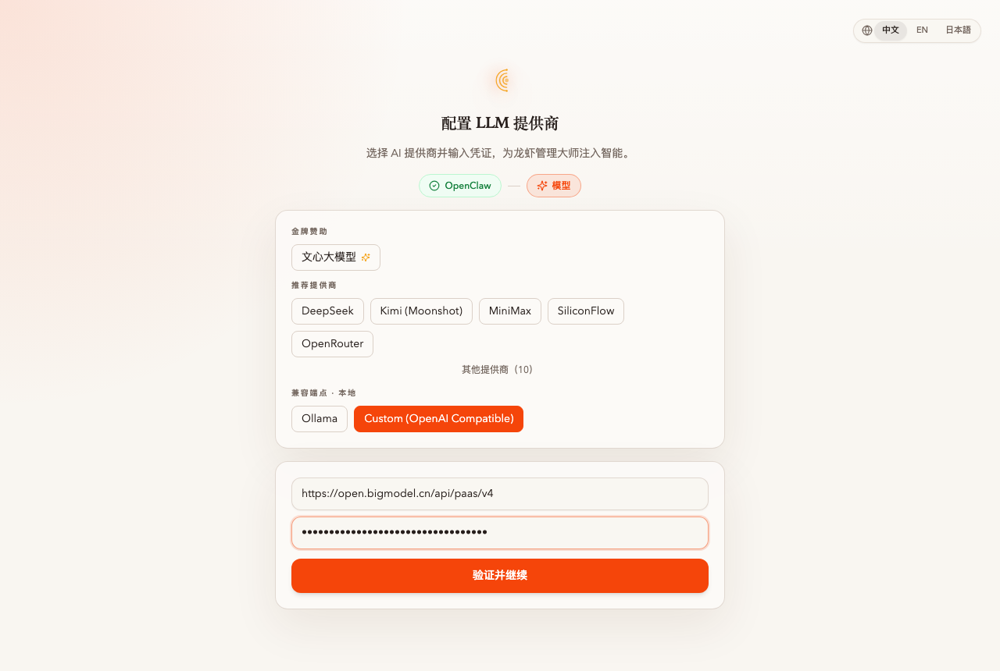
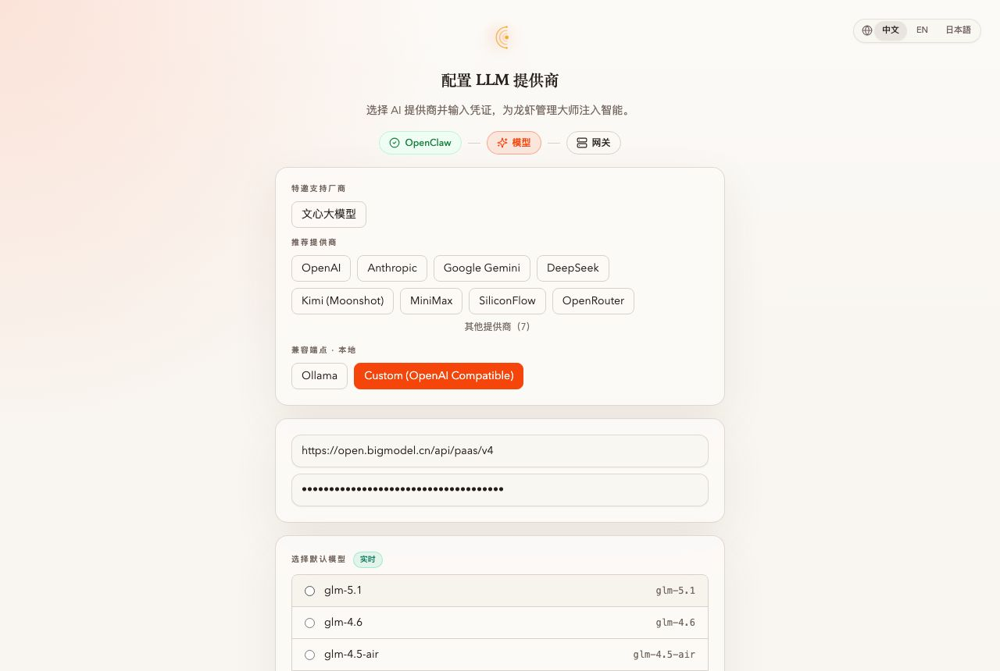
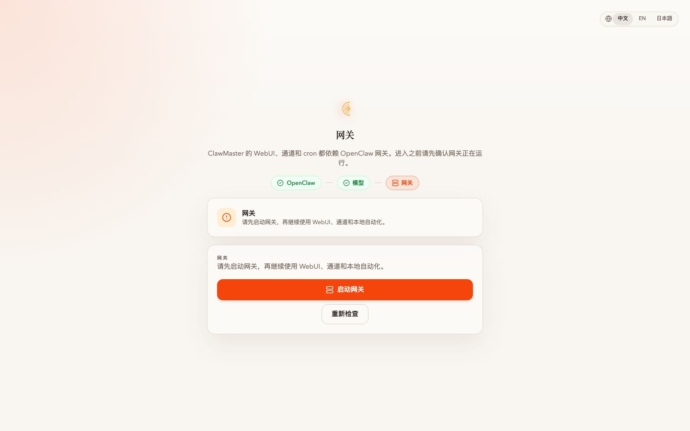
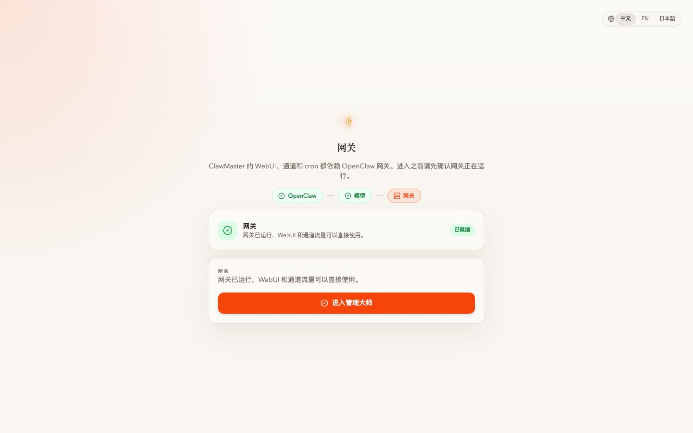

# 任务：用设置向导配置 ERNIE + GLM

**能力域**：Setup · **用时**：~10 min · **难度**：入门

> 三步式向导：完成 OpenClaw 引擎检测 → 接入文心大模型（金牌赞助）+ 智谱 GLM（Custom OpenAI Compatible）+ 选默认模型 → 确认 OpenClaw 网关已运行。

## 前置条件

1. **Node.js 22+ LTS** + **npm 10+**（`node -v` 应 ≥ v22；Node 20 本月进入 maintenance，新装直接用 22）
2. 两张令牌：
   - 百度 AI Studio：<https://aistudio.baidu.com/usercenter/token>（注册送 100 万 + 完善资料再送 100 万 tokens）
   - 智谱 BigModel：<https://open.bigmodel.cn/> 的 API Keys 页
3. 本机无已有 OpenClaw 配置（或已清空 `~/.openclaw/openclaw.json`）

## 启动

```bash
npm i -g clawmaster@rc && clawmaster
```

打开 <http://localhost:16223>，向导自动启动。

---

## 第 1 步：引擎检测



向导首屏自动检测 OpenClaw：已安装直接进下一步；未安装会出现「安装核心引擎」按钮，点一下走 npm 全局安装。

> 💡 纯体验演示可加 `?demo=install`。

---

## 第 2 步：选择提供商



界面按三层组织：**金牌赞助**（文心）· **推荐提供商**（DeepSeek / Kimi / MiniMax / SiliconFlow / OpenRouter 等）· **兼容端点 · 本地**（Ollama / Custom OpenAI Compatible）。默认选中金牌赞助的文心，先从它配起。

---

## 第 3 步：配置文心大模型



粘贴令牌 → **验证并继续**。向导会对 `aistudio.baidu.com/llm/lmapi/v3/chat/completions` 发 `max_tokens=1` 探测。

验证通过后会拉出动态模型列表。选一个作为默认模型（推荐 **ERNIE 5.0 Thinking Preview**）：



写入 `agents.defaults.model.primary`。

---

## 第 4 步：添加 GLM（Custom OpenAI Compatible）

GLM 不在金牌/推荐分组，但暴露标准 OpenAI Compatible 端点。在「兼容端点 · 本地」点 **Custom (OpenAI Compatible)**：



| 字段 | 值 |
|---|---|
| API Base URL | `https://open.bigmodel.cn/api/paas/v4` |
| API Key | 智谱开放平台生成的 key |

> ⚠️ Base URL 填到 `/v4` 结尾（不要带 `/chat/completions`）。

**验证并继续**。成功后会渲染 `GET /v4/models` 的结果为单选列表，下方还有手动输入框做兜底：



优先从列表选（`glm-5.1` / `glm-4.5-air` / `glm-4-flash`），仅当 `/models` 不可用时才手动敲。

---

## 第 5 步：网关检测



模型配完后，向导会跳到第 3 步「网关」。ClawMaster 的 WebUI、通道、cron 都依赖 OpenClaw 网关（默认端口 `18789`），所以在进入控制台前要先确认它活着。

向导会自动调用一次状态检测：
- **橙色 ⚠ 未运行** — 点 **「启动网关」**，向导会后台拉起 `openclaw gateway start`，2–3 秒后自动复检
- **绿色 ✓ 已就绪** — 直接出现「进入管理大师」按钮，跳过启动步骤

启动失败常见于端口被占（`lsof -ti:18789`）或 Node 版本不够。可以在终端手动 `openclaw gateway start --port 18789` 排查，再回向导点「重新检查」。

---

## 第 6 步：完成



网关绿了之后点 **「进入管理大师」**。向导把两个 provider 写进 `~/.openclaw/openclaw.json` → 跳到概览页。

---

## 验证

```bash
# UI：「模型」页面应看到 baidu-aistudio + custom-openai-compatible 两个 provider
# CLI：
openclaw providers list
openclaw models default
openclaw chat "用一句话介绍你自己"
# 或直接看配置：
jq '.models.providers | keys, .agents.defaults.model.primary' ~/.openclaw/openclaw.json
```

---

## 常见问题

**Q：卡在「验证中...」** → 10 秒后会超时。常见原因：网络不通 / Base URL 拼错（多带 `/chat/completions`）/ key 欠费。

**Q：ERNIE 验证通过但模型列表空** → `/models` 返回 401 的罕见情况。手动输入 `ernie-5.0-thinking-preview` 即可。

**Q：GLM 返回 unknown model** → key 没绑定对应模型额度，去平台控制台确认。

**Q：网关启动失败 / 超时** → 端口冲突多见。`lsof -ti:18789` 看有谁占着，旧进程 `kill` 掉再回向导点「重新检查」；Node 版本低于 22 也会拒启，升级后重跑 `clawmaster`。

---

## 下一步

- Observe：给刚配好的模型观察 tokens + cost → [cron-cost-digest-1min](../../observe/cron-cost-digest-1min/README_CN.md)
- Build：安装 `ernie-image` + `content-draft` 做带图文章 → [ernie-image-illustrated-article](../../build/ernie-image-illustrated-article/README_CN.md)
- Save：启用 PowerMem 沉淀长期记忆
