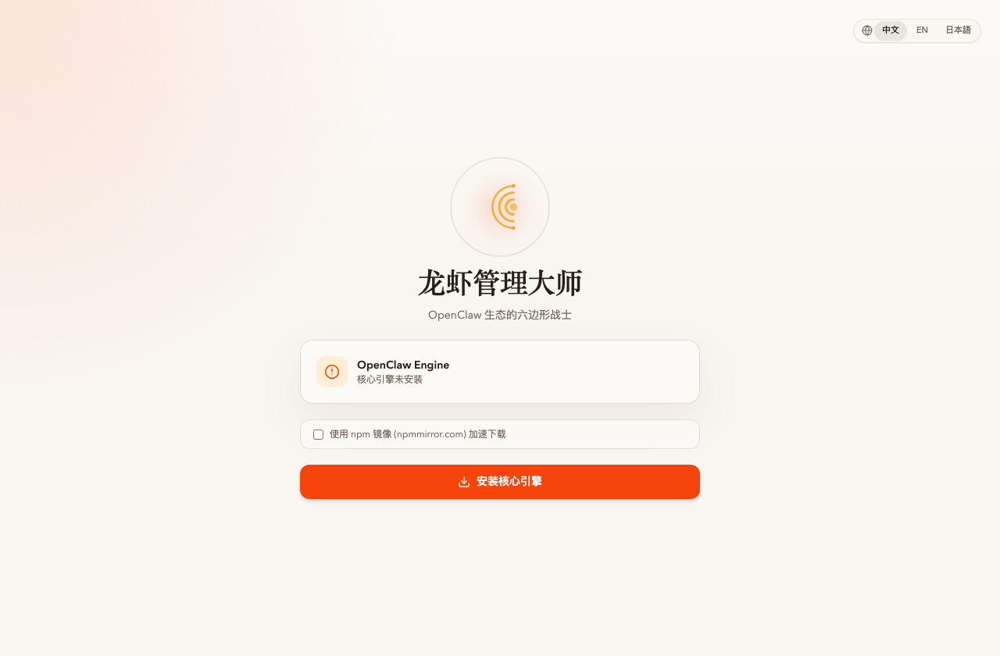
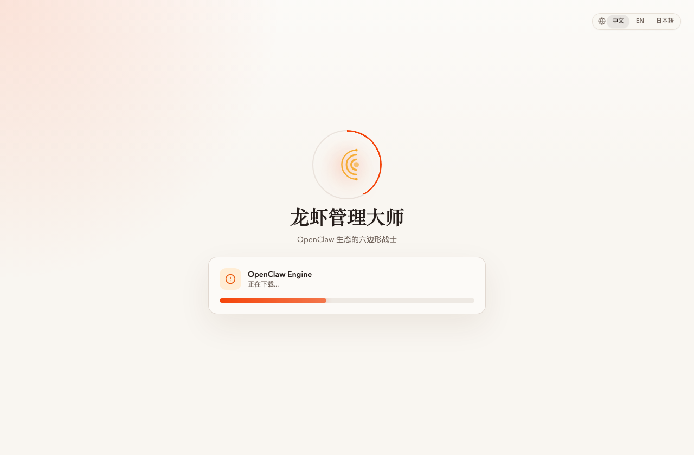
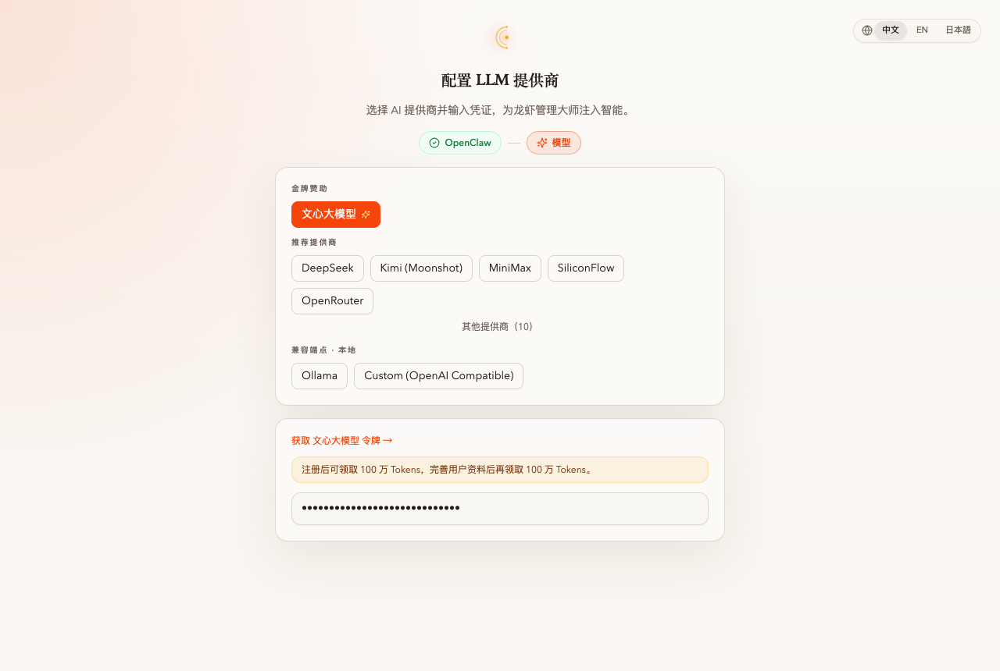

# タスク：セットアップ ウィザードで ERNIE + GLM を設定

**能力域**：Setup（コア能力 #1）
**所要時間**：約 10 分
**レベル**：初級

> 3 ステップのセットアップ ウィザードを使い、OpenClaw 検出・中国系 LLM プロバイダ 2 社（Baidu ERNIE + Zhipu GLM）の API キー検証・デフォルト モデル選択・OpenClaw ゲートウェイ稼働確認を行い、ClawMaster コンソールに到達します。

> 🌐 **このタスクは最初に中国語で執筆** されました — スクリーンショットと最も整合する完全版は **[README_CN.md](./README_CN.md)** です。日本語訳は追って提供予定。English: [README.md](./README.md)

## 前提条件

1. **Node.js 22+ LTS** と **npm 10+**（`node -v` が v22 以上。Node 20 は今月 maintenance 入り、新規インストールは直接 22 を推奨）
2. 2 種類のトークン：
   - Baidu AI Studio — <https://aistudio.baidu.com/usercenter/token>
   - Zhipu BigModel — <https://open.bigmodel.cn/> の API Keys ページ
3. 本機に既存の OpenClaw 設定がない（あるいは `~/.openclaw/openclaw.json` を削除済み）

## 手順サマリ

1. インストール：`npm i -g clawmaster@rc && clawmaster`
2. <http://localhost:16223> を開く — ウィザードが起動
3. エンジン検出が完了するまで待つ
4. デフォルトの **文心大模型 / ERNIE** のまま、Baidu AI Studio トークンを貼り付け、**「验证并继续」** をクリック、モデルを選択
5. **Custom (OpenAI Compatible)** をクリックし、以下を入力：
   - Base URL：`https://open.bigmodel.cn/api/paas/v4`
   - API Key：Zhipu のキー
6. 検証 → モデル ID（例：`glm-5.1`）を入力 → **「次のステップ」**
7. ゲートウェイ検査：ウィザードが `/api/gateway/status` をプローブ。停止中なら **「ゲートウェイを起動」** をクリック。緑になったら **「进入管理大师」**
8. ダッシュボードに遷移し、両プロバイダが登録済み

## キーフレーム

*まっさらな環境：ウィザードが OpenClaw を検出できず「核心引擎安装」ボタンが出る。*

*クリック一発で `npm install -g openclaw` がそのまま走る — 解決 → ダウンロード → インストール → リンク。*

*階層化された Provider ピッカー。ERNIE はゴールド スポンサー層、GLM は最下層の Custom (OpenAI Compatible) から接続。*

*キー検証成功後、Provider のモデル カタログが動的にロードされる。*

*ステップ 3：ゲートウェイ検査。OpenClaw が 18789 で稼働していない場合、ウィザードがワンクリックで **「ゲートウェイを起動」** を提供。*

*ゲートウェイが緑 — **「进入管理大师」** をクリックしてダッシュボードへ。*

全 10 フレーム・トラブルシュート・検証コマンドを含む完全版は [README_CN.md](./README_CN.md) を参照してください。
